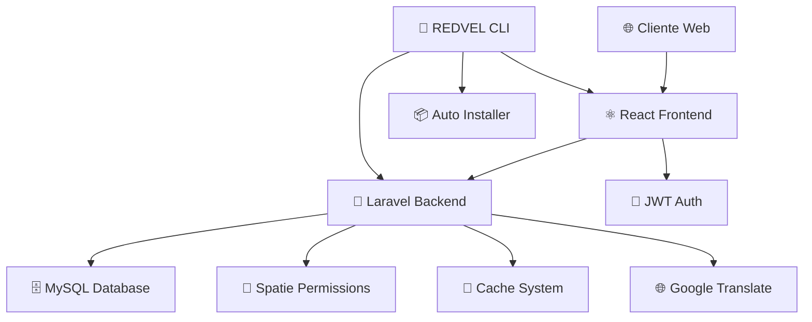
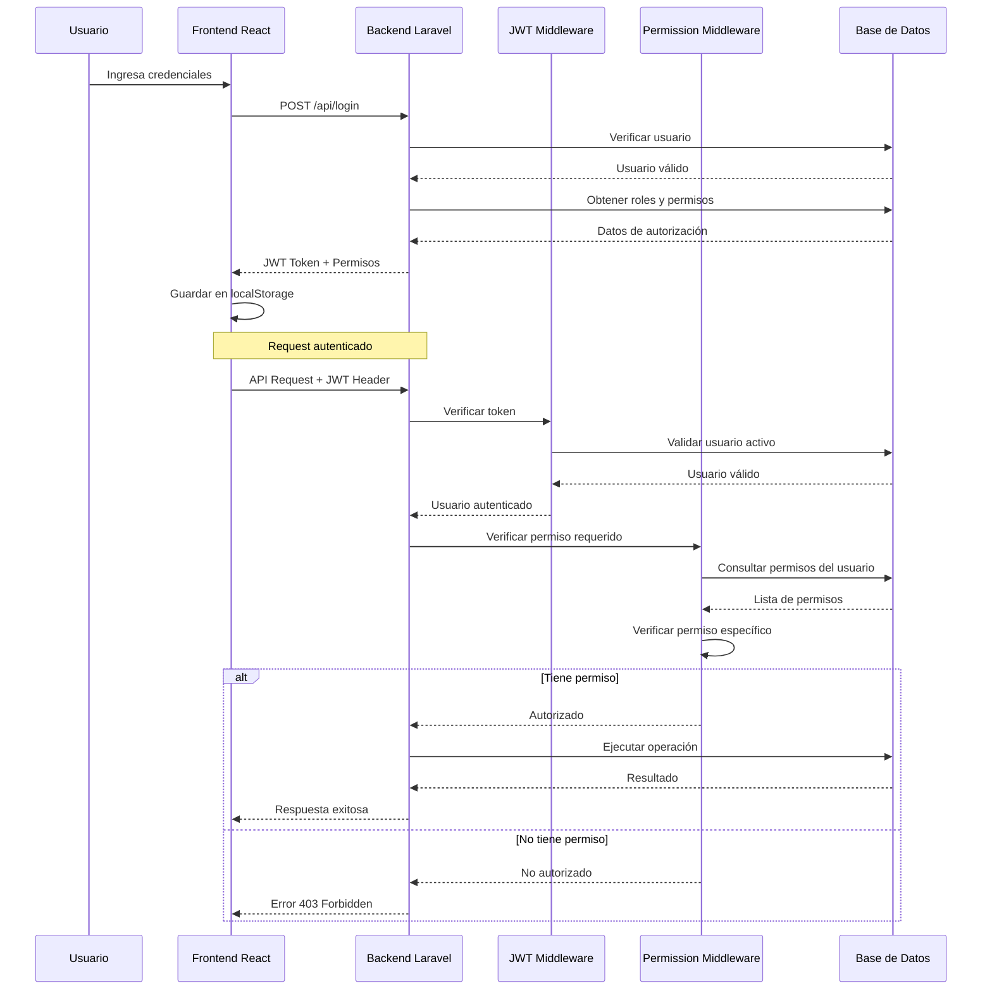
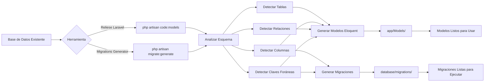
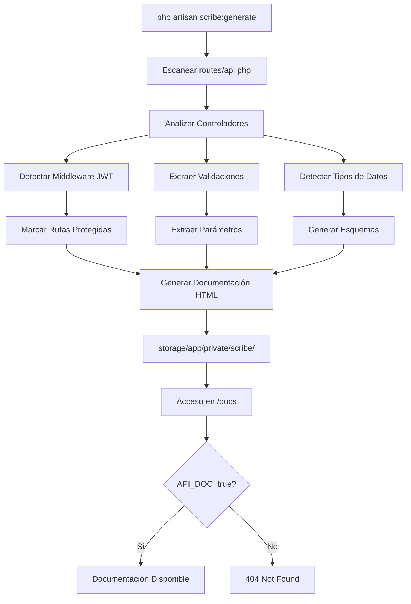
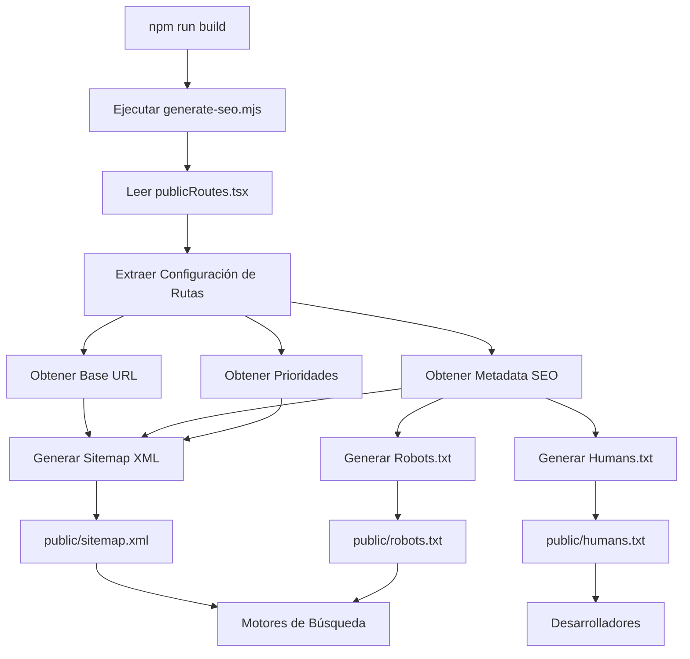
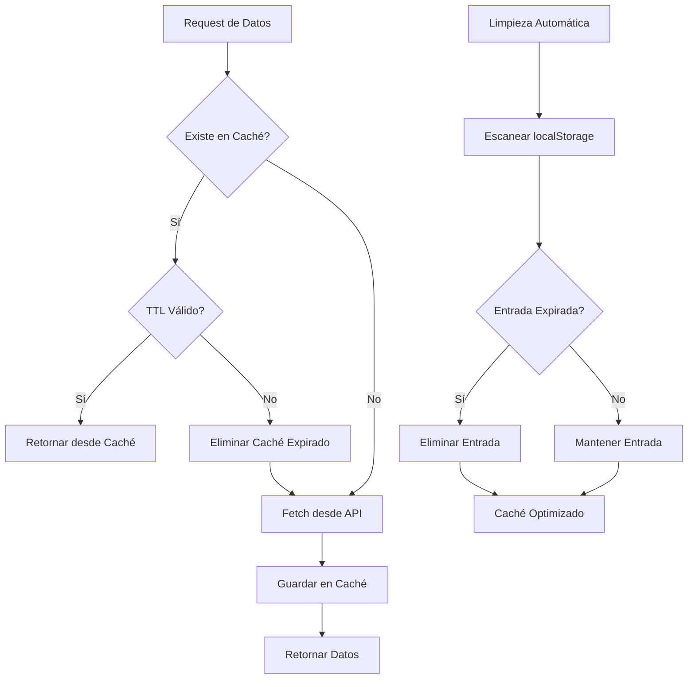
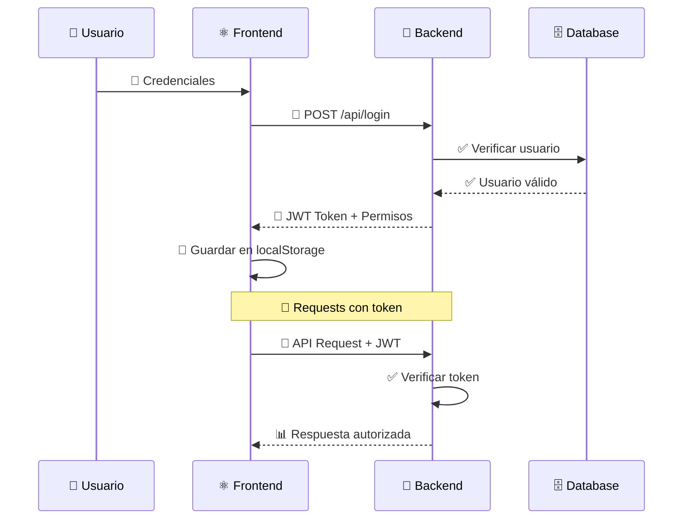
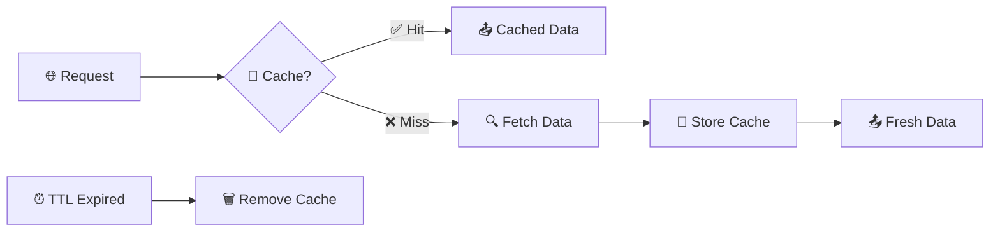
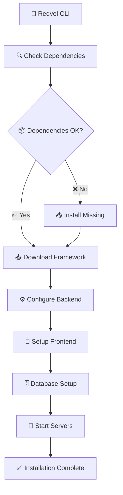

# REDVEL FRAMEWORK

<div align="center">


**Framework Full Stack Moderno para Desarrollo Web Rápido y Escalable**

[](https://laravel.com)
[](https://reactjs.org)
[](https://www.typescriptlang.org)
[](https://php.net)

</div>

---

## 👨‍💻 Desarrollador

<div align="center">


### **Luis Huaney Lino**

**Full Stack Developer & DevOps Engineer**

_"Desarrollé REDVEL para simplificar la creación de aplicaciones web robustas y escalables, proporcionando herramientas modernas que aceleren el desarrollo sin comprometer la calidad."_

📧 **Email:** martinlinohuaney@gmail.com  
📱 **WhatsApp:** +51 946 587 273  
🌐 **GitHub:** [luis-huaney-lino-devops](https://github.com/luis-huaney-lino-devops)

**¿Tienes ideas para nuevas funcionalidades o necesitas soporte personalizado?**  
¡No dudes en contactarme! Estoy disponible para colaboraciones y mejoras del framework.

</div>

---

## 🎯 ¿Qué es REDVEL?

**REDVEL** es un framework full stack que combina lo mejor de **Laravel** y **React** para crear aplicaciones web modernas, seguras y escalables. Diseñado para desarrolladores que buscan:

- ⚡ **Desarrollo rápido** sin sacrificar calidad
- 🔒 **Seguridad robusta** con JWT y control de permisos granular
- 🎨 **UI moderna** y responsive por defecto
- 🛠️ **Herramientas automatizadas** para tareas repetitivas
- 📚 **Documentación completa** y fácil mantenimiento

---

## 📋 Tabla de Contenidos

<div style="columns: 2; gap: 2rem;">

- [🚀 Inicio Rápido](#-inicio-rápido)
- [✨ Características](#-características-principales)
- [🏗️ Arquitectura](#️-arquitectura-del-sistema)
- [🔐 Autenticación](#-sistema-de-autenticación)
- [👥 Roles y Permisos](#-sistema-de-permisos-y-roles)
- [🎨 Frontend](#-frontend---redfront)
- [🔧 Backend](#-backend---redback)
- [🔧 Backend - Guía Completa](#backend---redback---guía-completa)
- [🎨 Frontend - Guía Completa](#frontend---redfront---guía-completa)
- [💾 Sistema de Caché](#-sistema-de-caché)
- [🛡️ Protección de Rutas](#️-protección-de-rutas)
- [🌐 Traducción](#-traducción-automática)
- [🎯 Gestor REDVEL](#-gestor-de-paquetes-redvel)
- [⚙️ Configuración](#️-configuración-del-entorno)
- [📚 Documentación API](#-documentación-api)
- [🤝 Contribuir](#-contribución)

</div>

---

## ✨ Características Principales

<div align="center">

|         🔐 **Autenticación JWT**         |  👥 **Control de Acceso**   |        🎨 **UI Moderna**         |
| :--------------------------------------: | :-------------------------: | :------------------------------: |
| Tokens seguros con renovación automática | Roles y permisos granulares | React 19 + TypeScript + Tailwind |

|         📱 **Responsive**          |   🔄 **Caché Inteligente**    |    🌐 **Multi-idioma**     |
| :--------------------------------: | :---------------------------: | :------------------------: |
| Adaptable a todos los dispositivos | Sistema TTL para optimización | Google Translate integrado |

|     🛡️ **Protección Total**      |   📊 **Dashboard Dinámico**   |       🔧 **Automatización**       |
| :------------------------------: | :---------------------------: | :-------------------------------: |
| Middleware en frontend y backend | Generación basada en permisos | Scripts y comandos personalizados |

</div>

---

## 🚀 Inicio Rápido

### 📋 Requisitos Previos

<div align="center">

|                                       Herramienta                                       | Versión Mínima | Estado |
| :-------------------------------------------------------------------------------------: | :------------: | :----: |
|                 |      8.2+      |   ✅   |
|      |     22.0+      |   ✅   |
|           |      8.0+      |   ✅   |
|  |      2.0+      |   ✅   |

</div>

### ⚡ Instalación Automática (Windows)

```bash
# 1. Descargar el instalador
curl -O https://github.com/luis-huaney-lino-devops/REDVEL-FRAMEWORK/raw/refs/heads/main/redvel.exe

# 2. Ejecutar instalación completa
redvel install

# 3. Iniciar servidores
redvel run
```

### 🐧 Instalación Manual (Linux/macOS)

```bash
# 1. Clonar repositorio
git clone https://github.com/luis-huaney-lino-devops/REDVEL-FRAMEWORK.git
cd REDVEL-FRAMEWORK

# 2. Backend
cd RedBack
composer install
cp .env.example .env
php artisan key:generate
php artisan jwt:secret

# 3. Frontend
cd ../RedFront
npm install

# 4. Configurar base de datos en .env y ejecutar
php artisan migrate --seed
php artisan serve &
npm run dev
```

### 🌐 URLs de Acceso

- **🔧 Backend:** http://localhost:8000
- **⚛️ Frontend:** http://localhost:3000
- **📚 API Docs:** http://localhost:8000/api/documentation
- **🚀 Instalador:** http://localhost:8000/install

---

## 🏗️ Arquitectura del Sistema

<div align="center">



</div>

### Flujo de Autenticación y Autorización

El siguiente diagrama muestra el flujo completo de autenticación y verificación de permisos en REDVEL:



### Flujo de Generación de Modelos y Migraciones

Diagrama que muestra el proceso de generación de modelos y migraciones desde una base de datos existente:



### Flujo de Documentación API Automática

Proceso de generación de documentación API con Scribe:



### Flujo de SEO y Generación de Sitemaps

Proceso de generación automática de archivos SEO:



### Flujo de Caché con TTL

Sistema de caché inteligente con expiración automática:



### 📁 Estructura de Directorios

```
REDVEL-FRAMEWORK/
├── 🔧 RedBack/                 # Backend Laravel
│   ├── 📂 app/
│   │   ├── Http/Controllers/
│   │   ├── Models/
│   │   └── Middleware/
│   ├── 📂 config/
│   ├── 📂 database/
│   │   ├── migrations/
│   │   └── seeders/
│   └── 📂 routes/
├── ⚛️ RedFront/               # Frontend React
│   ├── 📂 src/
│   │   ├── assets/
│   │   ├── components/
│   │   ├── pages/
│   │   └── hooks/
│   └── 📂 public/
├── 🎯 redvel.py               # CLI Manager
├── 🎯 redvel.exe              # Windows Installer
└── 📖 README.md
```

---

## 🔐 Sistema de Autenticación

### 🔒 JWT (JSON Web Tokens)

REDVEL utiliza JWT para autenticación segura y escalable:

<div align="center">



</div>

### ⚙️ Configuración JWT

```env
# Configuración en .env
JWT_SECRET=tu_clave_secreta_super_segura
JWT_TTL=60                    # 1 hora
TIEMPOSECION=60              # Tiempo de sesión
```

### 📡 Endpoints de Autenticación

```bash
POST   /api/login              # 🔐 Iniciar sesión
POST   /api/verificar-token    # ✅ Verificar token
POST   /api/renovar-token      # 🔄 Renovar token
POST   /api/logout             # 🚪 Cerrar sesión
```

---

## 👥 Sistema de Permisos y Roles

### 🎭 Roles del Sistema

REDVEL incluye un sistema flexible de roles para diferentes tipos de organizaciones:

<div align="center">

|         Rol          |        Descripción        | Nivel de Acceso |          Casos de Uso          |
| :------------------: | :-----------------------: | :-------------: | :----------------------------: |
|  🔧 **Super Admin**  | Control total del sistema |    **100%**     |  CTO, Administrador principal  |
| 👑 **Administrador** |      Gestión general      |     **90%**     |       Gerente, Director        |
|    👨‍💼 **Manager**    |  Supervisión de equipos   |     **70%**     |      Jefe de departamento      |
|    👨‍💻 **Editor**     |    Creación y edición     |     **60%**     | Content Manager, Desarrollador |
|    👁️ **Viewer**     |       Solo lectura        |     **30%**     |      Auditor, Consultante      |
|    🎓 **Usuario**    |       Acceso básico       |     **20%**     |     Cliente, Usuario final     |

</div>

### 🏷️ Categorías de Permisos

<details>
<summary><strong>👥 Gestión de Usuarios</strong></summary>

```php
// Usuarios - Administración de cuentas
'users.view'     → Ver listado de usuarios
'users.create'   → Crear nuevos usuarios
'users.edit'     → Editar información de usuarios
'users.delete'   → Eliminar usuarios
'users.restore'  → Restaurar usuarios eliminados
```

</details>

<details>
<summary><strong>📝 Gestión de Contenido</strong></summary>

```php
// Contenido - Posts, artículos, etc.
'content.view'     → Ver contenido
'content.create'   → Crear contenido
'content.edit'     → Editar contenido
'content.publish'  → Publicar contenido
'content.delete'   → Eliminar contenido
```

</details>

<details>
<summary><strong>📊 Reportes y Analytics</strong></summary>

```php
// Reportes - Estadísticas y métricas
'reports.view'      → Ver reportes básicos
'reports.advanced'  → Reportes avanzados
'reports.export'    → Exportar datos
'reports.create'    → Crear reportes personalizados
```

</details>

<details>
<summary><strong>⚙️ Configuración del Sistema</strong></summary>

```php
// Configuración - Ajustes del sistema
'config.view'    → Ver configuración
'config.edit'    → Modificar configuración
'config.system'  → Configuración del sistema
'config.security' → Configuración de seguridad
```

</details>

### 👤 Usuarios de Ejemplo

El sistema incluye usuarios predeterminados para testing y desarrollo:

<div align="center">

|    👤 Usuario    |     📧 Email     | 🔑 Contraseña |    🎭 Rol     |        💼 Perfil        |
| :--------------: | :--------------: | :-----------: | :-----------: | :---------------------: |
|   **john.doe**   | john@redvel.dev  |  `redvel123`  |  Super Admin  | Desarrollador Principal |
|  **jane.smith**  | jane@redvel.dev  |  `redvel123`  | Administrador |   Gerente de Proyecto   |
| **mike.johnson** | mike@redvel.dev  |  `redvel123`  |    Manager    |   Jefe de Desarrollo    |
| **anna.wilson**  | anna@redvel.dev  |  `redvel123`  |    Editor     |     Content Manager     |
|  **guest.user**  | guest@redvel.dev |  `redvel123`  |    Viewer     |   Usuario de Pruebas    |

</div>

### 🔧 Implementación de Roles

#### En el Seeder:

```php
// RolesAndPermissionsSeeder.php
class RolesAndPermissionsSeeder extends Seeder
{
    public function run(): void
    {
        // 🎭 Crear Roles
        $roles = [
            'super_admin' => 'Control total del sistema',
            'admin' => 'Gestión general de la aplicación',
            'manager' => 'Supervisión de equipos y proyectos',
            'editor' => 'Creación y edición de contenido',
            'viewer' => 'Solo lectura de información',
            'user' => 'Acceso básico de usuario final'
        ];

        foreach ($roles as $role => $description) {
            Role::create([
                'name' => $role,
                'description' => $description
            ]);
        }

        // 🏷️ Crear Permisos por categorías
        $permissions = [
            'users' => ['view', 'create', 'edit', 'delete', 'restore'],
            'content' => ['view', 'create', 'edit', 'publish', 'delete'],
            'reports' => ['view', 'advanced', 'export', 'create'],
            'config' => ['view', 'edit', 'system', 'security']
        ];

        foreach ($permissions as $category => $actions) {
            foreach ($actions as $action) {
                Permission::create(['name' => "$category.$action"]);
            }
        }

        // 🔗 Asignar Permisos a Roles
        $superAdmin = Role::findByName('super_admin');
        $superAdmin->givePermissionTo(Permission::all());

        $admin = Role::findByName('admin');
        $admin->givePermissionTo([
            'users.view', 'users.create', 'users.edit',
            'content.view', 'content.create', 'content.edit', 'content.publish',
            'reports.view', 'reports.advanced', 'reports.export'
        ]);
    }
}
```

#### En el Controller:

```php
// Verificar permisos en controllers
class UserController extends Controller
{
    public function index()
    {
        // ✅ Verificar permiso específico
        if (!auth()->user()->can('users.view')) {
            return response()->json(['error' => 'Sin permisos'], 403);
        }

        return response()->json(['users' => User::all()]);
    }

    public function store(Request $request)
    {
        // ✅ Middleware de permisos
        $this->middleware('permission:users.create');

        // Lógica de creación...
    }
}
```

#### En el Frontend React:

```tsx
// Hook para verificar permisos
export function usePermissions() {
  const checkPermission = (permission: string): boolean => {
    const permissions = getPermissionsFromToken();
    return permissions.includes(permission);
  };

  return { checkPermission };
}

// Componente con permisos
export function UserManagement() {
  const { checkPermission } = usePermissions();

  return (
    <div>
      {checkPermission("users.view") && <UserList />}

      {checkPermission("users.create") && <CreateUserButton />}

      {checkPermission("users.edit") && <EditUserButton />}
    </div>
  );
}
```

---

## 🎨 Frontend - RedFront

### 🛠️ Stack Tecnológico

<div align="center">


</div>

### 📱 Características del Frontend

- **🎨 Diseño Moderno**: Interfaz limpia con Tailwind CSS
- **📱 Totalmente Responsive**: Adaptable a móviles, tablets y desktop
- **🔥 Hot Reload**: Desarrollo rápido con Vite
- **🧩 Componentes Reutilizables**: Arquitectura component-based
- **🎯 TypeScript**: Tipado estático para mayor confiabilidad
- **🚀 Optimización**: Bundle optimizado para producción

### 🧩 Componentes Principales

#### 🔐 Sistema de Autenticación

```tsx
// Componente de Login
export function LoginForm() {
  const [credentials, setCredentials] = useState({
    username: "",
    password: "",
  });

  const handleLogin = async (e: React.FormEvent) => {
    e.preventDefault();

    try {
      const response = await authAPI.login(credentials);

      // 💾 Guardar token y permisos
      localStorage.setItem("token", response.token);
      localStorage.setItem("permissions", JSON.stringify(response.permissions));

      // 🎉 Notificación de éxito
      toast.success("¡Bienvenido a REDVEL!");
      navigate("/dashboard");
    } catch (error) {
      toast.error("Credenciales incorrectas");
    }
  };

  return (
    <form onSubmit={handleLogin} className="space-y-6">
      <div>
        <label className="block text-sm font-medium text-gray-700">
          Usuario
        </label>
        <input
          type="text"
          value={credentials.username}
          onChange={(e) =>
            setCredentials({
              ...credentials,
              username: e.target.value,
            })
          }
          className="mt-1 block w-full px-3 py-2 border border-gray-300 rounded-md shadow-sm focus:outline-none focus:ring-indigo-500 focus:border-indigo-500"
        />
      </div>

      <button
        type="submit"
        className="w-full flex justify-center py-2 px-4 border border-transparent rounded-md shadow-sm text-sm font-medium text-white bg-indigo-600 hover:bg-indigo-700 focus:outline-none focus:ring-2 focus:ring-offset-2 focus:ring-indigo-500"
      >
        🔐 Iniciar Sesión
      </button>
    </form>
  );
}
```

#### 🛡️ Protección de Rutas

```tsx
// Componente de ruta protegida
export function ProtectedRoute({
  children,
  requiredPermissions = [],
}: ProtectedRouteProps) {
  const location = useLocation();
  const { checkPermission } = usePermissions();

  // ✅ Verificar sesión válida
  if (!checkSession()) {
    toast.error("Sesión expirada. Por favor, inicia sesión nuevamente.");
    return <Navigate to="/login" state={{ from: location }} replace />;
  }

  // ✅ Verificar permisos específicos
  if (requiredPermissions.length > 0) {
    const hasPermission = requiredPermissions.every((permission) =>
      checkPermission(permission)
    );

    if (!hasPermission) {
      toast.error("No tienes permisos para acceder a esta página.");
      return <Navigate to="/403" state={{ from: location }} replace />;
    }
  }

  return <>{children}</>;
}
```

#### 🎯 Hook de Permisos

```tsx
// Custom hook para manejo de permisos
export function usePermissions() {
  const [permissions, setPermissions] = useState<string[]>([]);

  useEffect(() => {
    const userPermissions = getPermissionsFromToken();
    setPermissions(userPermissions);
  }, []);

  const checkPermission = useCallback(
    (permission: string): boolean => {
      return permissions.includes(permission);
    },
    [permissions]
  );

  const checkMultiplePermissions = useCallback(
    (permissionList: string[], requireAll: boolean = false): boolean => {
      if (requireAll) {
        return permissionList.every((permission) =>
          permissions.includes(permission)
        );
      }
      return permissionList.some((permission) =>
        permissions.includes(permission)
      );
    },
    [permissions]
  );

  const executeWithPermission = useCallback(
    <T,>(
      permission: string,
      action: () => T,
      errorMessage?: string
    ): T | null => {
      if (checkPermission(permission)) {
        return action();
      }

      if (errorMessage) {
        toast.error(errorMessage);
      }

      return null;
    },
    [checkPermission]
  );

  return {
    permissions,
    checkPermission,
    checkMultiplePermissions,
    executeWithPermission,
  };
}
```

---

## 🔧 Backend - RedBack

### 🛠️ Stack Tecnológico

<div align="center">


</div>

### 🏗️ Arquitectura del Backend

#### 📡 API Routes Principales

```php
// routes/api.php
<?php

use Illuminate\Support\Facades\Route;
use App\Http\Controllers\Auth\LoginController;
use App\Http\Controllers\Auth\ValidateController;

// 🌐 Rutas públicas
Route::get('/health', function () {
    return response()->json([
        'status' => 'ok',
        'timestamp' => now(),
        'version' => '1.0.0'
    ]);
});

Route::post('/login', [LoginController::class, 'login']);

// 🔐 Rutas autenticadas
Route::middleware(['check.jwt'])->group(function () {
    // Autenticación
    Route::post('/verificar-token', [ValidateController::class, 'verificarToken']);
    Route::post('/renovar-token', [ValidateController::class, 'renovarToken']);
    Route::post('/logout', [ValidateController::class, 'logout']);

    // 👥 Usuarios (requiere permisos específicos)
    Route::middleware(['check.permission:users.view'])->group(function () {
        Route::get('/users', [UserController::class, 'index']);
        Route::get('/users/{id}', [UserController::class, 'show']);
    });

    Route::middleware(['check.permission:users.create'])->group(function () {
        Route::post('/users', [UserController::class, 'store']);
    });

    Route::middleware(['check.permission:users.edit'])->group(function () {
        Route::put('/users/{id}', [UserController::class, 'update']);
    });

    Route::middleware(['check.permission:users.delete'])->group(function () {
        Route::delete('/users/{id}', [UserController::class, 'destroy']);
    });
});
```

#### 🔒 Middleware de Autenticación JWT

```php
// app/Http/Middleware/CheckJwtMiddleware.php
<?php

namespace App\Http\Middleware;

use Closure;
use Illuminate\Http\Request;
use Tymon\JWTAuth\Facades\JWTAuth;
use Tymon\JWTAuth\Exceptions\JWTException;

class CheckJwtMiddleware
{
    public function handle(Request $request, Closure $next)
    {
        try {
            // ✅ Verificar y decodificar token
            $user = JWTAuth::parseToken()->authenticate();

            if (!$user) {
                return response()->json([
                    'error' => 'Usuario no encontrado',
                    'code' => 'USER_NOT_FOUND'
                ], 401);
            }

            // ✅ Verificar si el usuario está activo
            if (!$user->activo) {
                return response()->json([
                    'error' => 'Usuario inactivo',
                    'code' => 'USER_INACTIVE'
                ], 401);
            }

            // 📝 Registrar actividad del usuario
            $user->update(['ultima_actividad' => now()]);

        } catch (JWTException $e) {
            return response()->json([
                'error' => 'Token inválido o expirado',
                'code' => 'TOKEN_INVALID',
                'message' => $e->getMessage()
            ], 401);
        }

        return $next($request);
    }
}
```

#### 🛡️ Middleware de Permisos

```php
// app/Http/Middleware/CheckPermissionMiddleware.php
<?php

namespace App\Http\Middleware;

use Closure;
use Illuminate\Http\Request;

class CheckPermissionMiddleware
{
    public function handle(Request $request, Closure $next, $permission)
    {
        $user = auth()->user();

        // ✅ Verificar si el usuario tiene el permiso
        if (!$user->can($permission)) {
            return response()->json([
                'error' => 'No tienes permisos para realizar esta acción',
                'required_permission' => $permission,
                'user_permissions' => $user->getAllPermissions()->pluck('name'),
                'code' => 'INSUFFICIENT_PERMISSIONS'
            ], 403);
        }

        // 📝 Log de actividad con permisos
        \Log::info("User {$user->id} accessed resource with permission: {$permission}");

        return $next($request);
    }
}
```

#### 👤 Modelo Usuario Mejorado

```php
// app/Models/Usuario.php
<?php

namespace App\Models;

use Illuminate\Foundation\Auth\User as Authenticatable;
use Tymon\JWTAuth\Contracts\JWTSubject;
use Spatie\Permission\Traits\HasRoles;
use Illuminate\Database\Eloquent\SoftDeletes;

class Usuario extends Authenticatable implements JWTSubject
{
    use HasRoles, SoftDeletes;

    protected $fillable = [
        'nomusu',
        'email',
        'password',
        'activo',
        'ultimo_login',
        'ultima_actividad',
        'intentos_login',
        'bloqueado_hasta'
    ];

    protected $hidden = [
        'password',
        'remember_token',
    ];

    protected $casts = [
        'activo' => 'boolean',
        'ultimo_login' => 'datetime',
        'ultima_actividad' => 'datetime',
        'bloqueado_hasta' => 'datetime',
        'intentos_login' => 'integer'
    ];

    // 🎫 JWT Methods
    public function getJWTIdentifier()
    {
        return $this->getKey();
    }

    public function getJWTCustomClaims()
    {
        return [
            'user_id' => $this->id,
            'username' => $this->nomusu,
            'email' => $this->email,
            'roles' => $this->getRoleNames(),
            'permissions' => $this->getAllPermissions()->pluck('name'),
            'last_login' => $this->ultimo_login?->toISOString(),
            'is_active' => $this->activo
        ];
    }

    // 🔐 Security Methods
    public function incrementLoginAttempts()
    {
        $this->increment('intentos_login');

        if ($this->intentos_login >= 5) {
            $this->update([
                'bloqueado_hasta' => now()->addMinutes(30)
            ]);
        }
    }

    public function resetLoginAttempts()
    {
        $this->update([
            'intentos_login' => 0,
            'bloqueado_hasta' => null,
            'ultimo_login' => now()
        ]);
    }

    public function isBlocked(): bool
    {
        return $this->bloqueado_hasta && $this->bloqueado_hasta->isFuture();
    }

    // 🔗 Relationships
    public function persona()
    {
        return $this->belongsTo(Persona::class, 'fk_idpersonas');
    }

    // 📊 Scopes
    public function scopeActive($query)
    {
        return $query->where('activo', true);
    }

    public function scopeNotBlocked($query)
    {
        return $query->where(function($q) {
            $q->whereNull('bloqueado_hasta')
              ->orWhere('bloqueado_hasta', '<', now());
        });
    }
}
```

---

## Backend - RedBack - Guía Completa

### Instalación del Backend

El backend de REDVEL utiliza Laravel 12 con PHP 8.2+. Sigue estos pasos para la instalación:

```bash
# 1. Navegar al directorio del backend
cd RedBack

# 2. Instalar dependencias de Composer
composer install

# 3. Configurar archivo de entorno
cp .env.example .env

# 4. Generar clave de aplicación
php artisan key:generate

# 5. Configurar JWT Secret
php artisan jwt:secret

# 6. Configurar base de datos en .env
# Editar DB_DATABASE, DB_USERNAME, DB_PASSWORD

# 7. Ejecutar migraciones y seeders
php artisan migrate --seed
```

### Generación de Modelos desde Base de Datos

REDVEL incluye **Reliese Laravel** para generar modelos Eloquent automáticamente desde una base de datos existente.

#### Configuración

La configuración se encuentra en `config/models.php`. Puedes personalizar:

- **Ruta de modelos**: `app/Models` (por defecto)
- **Namespace**: `App\Models` (por defecto)
- **Tablas excluidas**: migrations, failed_jobs, password_resets, etc.
- **Prefijo de tablas**: Si tus tablas tienen prefijo, puedes eliminarlo del nombre del modelo
- **Relaciones**: Se generan automáticamente basadas en claves foráneas

#### Comandos Disponibles

```bash
# Generar modelos para todas las tablas
php artisan code:models

# Generar modelos para tablas específicas
php artisan code:models --table=usuarios
php artisan code:models --table=personas,generos

# Generar modelos excluyendo ciertas tablas
php artisan code:models --ignore=tabla1,tabla2

# Generar modelos con archivos base (para personalización)
php artisan code:models --base-files
```

#### Características Generadas Automáticamente

- **Propiedades del modelo**: Tipos de datos, nullable, etc.
- **Relaciones Eloquent**: hasMany, belongsTo, belongsToMany
- **Fillable attributes**: Campos que pueden ser asignados masivamente
- **Primary keys**: Identificación automática de claves primarias
- **Timestamps**: Detección automática de created_at/updated_at
- **Soft deletes**: Detección de deleted_at

#### Ejemplo de Modelo Generado

```php
<?php
namespace App\Models;

use Illuminate\Database\Eloquent\Model;

class Persona extends Model
{
    protected $table = 'personas';
    protected $primaryKey = 'idpersonas';
    
    protected $fillable = [
        'nombre',
        'apellido',
        'email',
        'fk_idgeneros'
    ];
    
    // Relación generada automáticamente
    public function genero()
    {
        return $this->belongsTo(Genero::class, 'fk_idgeneros');
    }
}
```

### Generación de Migraciones desde Base de Datos

REDVEL incluye **kitloong/laravel-migrations-generator** para generar migraciones desde una base de datos existente.

#### Comandos Disponibles

```bash
# Generar migraciones para todas las tablas
php artisan migrate:generate

# Generar migraciones para tablas específicas
php artisan migrate:generate --tables=usuarios,personas

# Generar migraciones excluyendo ciertas tablas
php artisan migrate:generate --ignore=tabla1,tabla2

# Generar migraciones con conexión específica
php artisan migrate:generate --connection=mysql

# Generar migraciones sin índices
php artisan migrate:generate --no-indexes

# Generar migraciones sin claves foráneas
php artisan migrate:generate --no-foreign-keys
```

#### Opciones Avanzadas

```bash
# Generar migraciones con prefijo de tabla
php artisan migrate:generate --table-prefix=app_

# Generar migraciones con conexión específica
php artisan migrate:generate --connection=mysql

# Generar migraciones con formato de timestamp personalizado
php artisan migrate:generate --date-format=Y_m_d_His
```

#### Casos de Uso

**Caso 1: Migrar base de datos existente a Laravel**

```bash
# 1. Conectar a la base de datos existente
# 2. Generar todas las migraciones
php artisan migrate:generate

# 3. Revisar y ajustar las migraciones generadas
# 4. Ejecutar migraciones en nuevo entorno
php artisan migrate
```

**Caso 2: Sincronizar cambios de base de datos**

```bash
# 1. Hacer cambios en la base de datos directamente
# 2. Generar migraciones solo para tablas modificadas
php artisan migrate:generate --tables=usuarios,personas

# 3. Revisar migraciones generadas
# 4. Aplicar en otros entornos
```

### Generación de Documentación API Automática

REDVEL soporta dos sistemas de documentación automática: **Scribe** (recomendado) y **L5-Swagger**.

#### Scribe - Documentación Automática sin Anotaciones

Scribe genera documentación completamente automática sin necesidad de anotaciones en el código.

**Configuración inicial:**

```bash
# 1. Agregar en .env
API_DOC=true

# 2. Publicar configuración (solo primera vez)
php artisan vendor:publish --provider="Knuckles\Scribe\ScribeServiceProvider" --tag=scribe-config

# 3. Generar documentación
php artisan scribe:generate
```

**Acceder a la documentación:**

- URL: `http://localhost:8000/docs`
- Solo disponible si `API_DOC=true` en `.env`

**Características automáticas:**

- **Detección automática de autenticación**: Detecta rutas protegidas por middleware `check.jwt`
- **Extracción automática de parámetros**: Desde `$request->validate()` en controladores
- **Detección de tipos de datos**: String, integer, boolean, etc.
- **Validaciones**: Required, max, min, email, etc.
- **Ejemplos**: Genera ejemplos automáticos basados en validaciones

**Regenerar documentación:**

```bash
# Cada vez que agregues o modifiques rutas/controladores
php artisan scribe:generate
```

#### L5-Swagger - Documentación con Anotaciones OpenAPI

L5-Swagger requiere anotaciones OpenAPI pero ofrece más control sobre la documentación.

**Generar documentación:**

```bash
php artisan l5-swagger:generate
```

**Acceder a la documentación:**

- URL: `http://localhost:8000/api/documentation`
- Solo disponible si `API_DOC=true` en `.env`

**Ejemplo de anotación:**

```php
/**
 * @OA\Post(
 *     path="/api/users",
 *     summary="Crear usuario",
 *     @OA\RequestBody(
 *         required=true,
 *         @OA\JsonContent(
 *             @OA\Property(property="username", type="string", example="john.doe"),
 *             @OA\Property(property="email", type="string", format="email", example="john@example.com")
 *         )
 *     ),
 *     @OA\Response(response=201, description="Usuario creado")
 * )
 */
public function store(Request $request) { ... }
```

### Comandos de Permisos y Roles

REDVEL utiliza Spatie Laravel Permission para gestión de permisos.

#### Comandos Disponibles

```bash
# Limpiar caché de permisos (importante después de cambios)
php artisan permission:cache-reset

# Ejecutar seeder de roles y permisos
php artisan db:seed --class=RolesAndPermissionsSeeder

# Verificar permisos (comando personalizado)
php artisan verificar:permisos
```

#### Solución de Problemas de Permisos

Si encuentras errores de permisos con guard 'api':

```bash
# 1. Limpiar caché de permisos
php artisan permission:cache-reset

# 2. Ejecutar seeder actualizado
php artisan db:seed --class=RolesAndPermissionsSeeder

# 3. Limpiar caché nuevamente
php artisan permission:cache-reset

# 4. Limpiar caché general de Laravel
php artisan config:clear
php artisan cache:clear
```

#### Verificar Permisos en Tinker

```bash
php artisan tinker
```

```php
use Spatie\Permission\Models\Permission;
use Spatie\Permission\Models\Role;

// Ver todos los permisos con guard 'api'
Permission::where('guard_name', 'api')->pluck('name');

// Ver roles con guard 'api'
Role::where('guard_name', 'api')->pluck('name');

// Verificar permisos de un usuario
$user = App\Models\Usuario::find(1);
$user->getAllPermissions()->pluck('name');
```

### Otros Comandos Útiles

```bash
# Desarrollo
php artisan serve                    # Iniciar servidor de desarrollo
php artisan queue:listen            # Escuchar colas
php artisan tinker                  # REPL interactivo

# Caché
php artisan config:clear            # Limpiar caché de configuración
php artisan cache:clear              # Limpiar caché de aplicación
php artisan route:clear              # Limpiar caché de rutas
php artisan view:clear               # Limpiar caché de vistas

# Base de datos
php artisan migrate                  # Ejecutar migraciones pendientes
php artisan migrate:fresh            # Resetear base de datos y ejecutar migraciones
php artisan migrate:refresh          # Refrescar todas las migraciones
php artisan db:seed                  # Ejecutar seeders
php artisan migrate:fresh --seed     # Resetear y poblar base de datos

# Testing
php artisan test                     # Ejecutar tests
php artisan test --filter=NombreTest # Ejecutar test específico

# Optimización
php artisan optimize                 # Optimizar aplicación para producción
php artisan config:cache             # Cachear configuración
php artisan route:cache              # Cachear rutas
php artisan view:cache               # Cachear vistas
```

### Instalación mediante Instalador Web

REDVEL incluye un instalador web que automatiza el proceso de instalación:

**Acceder al instalador:**

- URL: `http://localhost:8000/install`

**Proceso de instalación:**

1. Verificación de conexión a base de datos
2. Ejecución de migraciones
3. Creación de usuarios predeterminados
4. Asignación de roles y permisos
5. Configuración inicial

---

## Frontend - RedFront - Guía Completa

### Instalación del Frontend

El frontend de REDVEL utiliza React 19 con TypeScript y Vite.

```bash
# 1. Navegar al directorio del frontend
cd RedFront

# 2. Instalar dependencias
npm install

# 3. Configurar variables de entorno (si es necesario)
# Editar .env o .env.local

# 4. Iniciar servidor de desarrollo
npm run dev

# 5. Construir para producción
npm run build
```

### Sistema de Rutas

REDVEL implementa un sistema de rutas modular que separa rutas públicas y protegidas.

#### Estructura de Rutas

```
RedFront/src/Routes/
├── index.ts              # Exportaciones centralizadas
├── publicRoutes.tsx      # Rutas públicas (accesibles sin autenticación)
├── protectedRoutes.tsx   # Rutas protegidas (requieren autenticación)
└── errorRoutes.tsx       # Rutas de error (404, 403, etc.)
```

#### Rutas Públicas

Las rutas públicas son accesibles sin autenticación y se incluyen automáticamente en el sitemap.

**Configuración de ruta pública:**

```typescript
// src/Routes/publicRoutes.tsx
export const publicRoutesConfig: PublicRoute[] = [
  {
    path: "/",
    element: Redvel,
    importancia: 1.0,  // Prioridad en sitemap (0.0 - 1.0)
    title: "REDVEL Framework - Sistema de Gestión",
    description: "Framework robusto para desarrollo de aplicaciones web modernas",
    keywords: ["redvel", "framework", "sistema", "gestión"],
    changefreq: "weekly",  // Frecuencia de actualización
  },
  {
    path: "/login",
    element: LoginPage,
    importancia: 0.5,
    title: "Iniciar Sesión - REDVEL",
    description: "Inicia sesión en tu cuenta de REDVEL",
    keywords: ["login", "iniciar sesión", "autenticación"],
    changefreq: "monthly",
  },
];
```

**Propiedades de configuración:**

- `path`: Ruta de la página
- `element`: Componente React (lazy-loaded)
- `importancia`: Prioridad en sitemap (0.0 - 1.0)
- `title`: Título SEO de la página
- `description`: Descripción SEO
- `keywords`: Array de palabras clave
- `changefreq`: Frecuencia de actualización (always, hourly, daily, weekly, monthly, yearly, never)

#### Rutas Protegidas

Las rutas protegidas requieren autenticación y pueden requerir permisos específicos.

**Configuración de ruta protegida:**

```typescript
// src/Routes/protectedRoutes.tsx
export function getProtectedRoutes() {
  return [
    <Route
      key="/usuarios/lista"
      path="/usuarios/lista"
      element={
        <ProtectedRoute requiredPermissions={["usuarios.view"]}>
          <PageUsuarios />
        </ProtectedRoute>
      }
    />,
    <Route
      key="dashboard-layout"
      element={
        <ProtectedRoute>
          <DashboardLayout />
        </ProtectedRoute>
      }
    >
      <Route path="/dashboard" element={<Dashboard />} />
      <Route path="/inicio" element={<Inicio />} />
    </Route>,
  ];
}
```

**Opciones de ProtectedRoute:**

- `requiredPermissions`: Array de permisos requeridos
- `requiredRoles`: Array de roles requeridos
- `requireAll`: Si true, requiere todos los permisos/roles (por defecto: false)
- `fallbackPath`: Ruta de redirección si no tiene permisos (por defecto: "/403")

#### Uso en la Aplicación

```typescript
// src/App.tsx
import { getPublicRoutes } from "./Routes/publicRoutes";
import { getProtectedRoutes } from "./Routes/protectedRoutes";
import { getErrorRoutes } from "./Routes/errorRoutes";

function App() {
  return (
    <Router>
      <Routes>
        {getPublicRoutes()}
        {getProtectedRoutes()}
        {getErrorRoutes()}
      </Routes>
    </Router>
  );
}
```

### Componentes SEO

REDVEL incluye componentes especializados para gestión de SEO.

#### SeoWrapper

Componente wrapper que aplica metadata SEO básica a páginas.

**Uso básico:**

```typescript
import { SeoWrapper } from "@/assets/lib/SeoWrapper";

function MiPagina() {
  return (
    <SeoWrapper
      title="Título de la Página"
      description="Descripción de la página para SEO"
      keywords={["palabra1", "palabra2", "palabra3"]}
      contentType="website"
    >
      <ContenidoDeLaPagina />
    </SeoWrapper>
  );
}
```

**Propiedades:**

- `title`: Título de la página (actualiza `<title>` y `og:title`)
- `description`: Descripción (actualiza `meta description` y `og:description`)
- `keywords`: Array de palabras clave
- `contentType`: Tipo de contenido Open Graph (default: "website")

**Características:**

- Actualiza automáticamente el título del documento
- Crea/actualiza meta tags de descripción
- Gestiona keywords para SEO
- Configura Open Graph básico

#### SeoHead

Componente avanzado para gestión completa de SEO y metadata.

**Uso completo:**

```typescript
import { SeoHead } from "@/assets/lib/SeoHead";

function ArticuloPage() {
  return (
    <>
      <SeoHead
        title="Título del Artículo"
        description="Descripción completa del artículo"
        keywords={["artículo", "tutorial", "guía"]}
        canonical="https://example.com/articulo"
        lang="es"
        author="Autor del Artículo"
        robots="index, follow"
        image="https://example.com/imagen.jpg"
        type="article"
        url="https://example.com/articulo"
        siteName="REDVEL Framework"
        twitterCard="summary_large_image"
        twitterSite="@redvel"
        twitterCreator="@autor"
        themeColor="#FF2D20"
        publishedTime="2024-01-01T00:00:00Z"
        modifiedTime="2024-01-15T00:00:00Z"
        section="Tutoriales"
        tags={["laravel", "react", "tutorial"]}
        customMeta={[
          { name: "custom-meta", content: "valor personalizado" }
        ]}
        customLinks={[
          { rel: "alternate", href: "https://example.com/en/article", hreflang: "en" }
        ]}
      />
      <ContenidoDelArticulo />
    </>
  );
}
```

**Propiedades principales:**

- **Básicas**: title, description, keywords, canonical, lang, author, robots
- **Open Graph**: image, type, url, siteName, publishedTime, modifiedTime, section, tags
- **Twitter Cards**: twitterCard, twitterSite, twitterCreator
- **Tema**: themeColor, tileColor
- **Personalización**: customMeta, customLinks

**Características:**

- Gestión completa de meta tags
- Soporte para Open Graph
- Soporte para Twitter Cards
- Meta tags personalizados
- Links personalizados (canonical, alternate, etc.)
- Actualización automática del `<head>`

#### Sistema de Caché

REDVEL incluye un sistema de caché con TTL (Time To Live) para optimizar el rendimiento.

**Uso básico:**

```typescript
import { getCache, setCache, removeCache } from "@/assets/lib/cache";

// Guardar en caché con TTL de 15 minutos
setCache("user_data", userData, 15 * 60 * 1000);

// Obtener del caché
const cachedData = getCache("user_data", 15 * 60 * 1000);

// Eliminar del caché
removeCache("user_data");
```

**Funciones disponibles:**

```typescript
// Guardar valor con TTL opcional
setCache<T>(key: string, value: T, ttl?: number): boolean

// Obtener valor (retorna null si expiró o no existe)
getCache<T>(key: string, ttl?: number): T | null

// Verificar si existe y no ha expirado
hasCache(key: string, ttl?: number): boolean

// Eliminar clave específica
removeCache(key: string): boolean

// Limpiar caché expirado
clearExpiredCache(): number

// Limpiar todo el caché (solo entradas con formato de caché)
clearAllCache(prefix?: string): number

// Obtener tamaño aproximado del caché en bytes
getCacheSize(): number
```

**Ejemplo de uso en componente:**

```typescript
import { useEffect, useState } from "react";
import { getCache, setCache } from "@/assets/lib/cache";

function UserProfile({ userId }: { userId: string }) {
  const [userData, setUserData] = useState(null);
  const [loading, setLoading] = useState(true);

  useEffect(() => {
    const cacheKey = `user_${userId}`;
    const ttl = 15 * 60 * 1000; // 15 minutos

    // Intentar obtener del caché
    const cached = getCache(cacheKey, ttl);
    if (cached) {
      setUserData(cached);
      setLoading(false);
      return;
    }

    // Si no hay caché, hacer request
    fetch(`/api/users/${userId}`)
      .then(res => res.json())
      .then(data => {
        setUserData(data);
        setCache(cacheKey, data, ttl);
        setLoading(false);
      });
  }, [userId]);

  if (loading) return <div>Cargando...</div>;
  return <div>{/* Renderizar datos */}</div>;
}
```

**Características del caché:**

- TTL configurable por entrada
- Persistencia en localStorage
- Limpieza automática de entradas expiradas
- Manejo de errores (localStorage lleno, modo privado, etc.)
- Validación de tipos TypeScript
- Prefijos opcionales para organización

### Generación Automática de Sitemaps

REDVEL genera automáticamente sitemaps basados en las rutas públicas configuradas.

#### Configuración

El script de generación se ejecuta automáticamente durante el build:

```bash
npm run build
```

También se puede ejecutar manualmente:

```bash
node scripts/generate-seo.mjs
```

#### Archivos Generados

El script genera tres archivos en `public/`:

1. **sitemap.xml**: Sitemap XML estándar con todas las rutas públicas
2. **robots.txt**: Archivo robots.txt con configuración de crawlers
3. **humans.txt**: Archivo humans.txt con información del sitio

#### Configuración de Base URL

La base URL se obtiene de `src/assets/constants/constantes.ts`:

```typescript
export const baseUrl: string = "http://localhost:3000";
```

#### Estructura del Sitemap

El sitemap incluye automáticamente:

- **URL**: URL completa de cada ruta pública
- **Lastmod**: Fecha de última modificación (actual)
- **Changefreq**: Frecuencia de actualización configurada en la ruta
- **Priority**: Prioridad basada en `importancia` (0.0 - 1.0)

#### Ejemplo de Sitemap Generado

```xml
<?xml version="1.0" encoding="UTF-8"?>
<urlset xmlns="http://www.sitemaps.org/schemas/sitemap/0.9">
  <url>
    <loc>http://localhost:3000/</loc>
    <lastmod>2024-01-15</lastmod>
    <changefreq>weekly</changefreq>
    <priority>1.0</priority>
  </url>
  <url>
    <loc>http://localhost:3000/login</loc>
    <lastmod>2024-01-15</lastmod>
    <changefreq>monthly</changefreq>
    <priority>0.5</priority>
  </url>
</urlset>
```

#### Robots.txt Generado

El robots.txt incluye:

- Permisos para motores de búsqueda principales
- Bloqueo de directorios administrativos
- Bloqueo de rutas protegidas
- Referencia al sitemap
- Crawl-delay configurado

#### Personalización

Para personalizar la generación, edita `scripts/generate-seo.mjs`:

- Modificar reglas de robots.txt
- Agregar rutas adicionales al sitemap
- Cambiar formato de fechas
- Agregar namespaces XML adicionales

### Mejoras de SEO Implementadas

REDVEL incluye múltiples mejoras de SEO:

#### Meta Tags Completos

- Título optimizado para cada página
- Descripción única y relevante
- Keywords estratégicas
- Canonical URLs
- Open Graph tags completos
- Twitter Cards

#### Estructura Semántica

- Uso correcto de headings (H1, H2, H3)
- Meta tags de idioma
- Schema.org markup (preparado)
- URLs amigables

#### Performance SEO

- Lazy loading de componentes
- Caché inteligente con TTL
- Optimización de imágenes (preparado)
- Minificación de assets en producción

#### Accesibilidad

- Atributos alt en imágenes
- Navegación por teclado
- Contraste de colores adecuado
- Etiquetas ARIA (preparado)

### Casos de Uso

#### Caso 1: Página Pública con SEO Completo

```typescript
import { SeoHead } from "@/assets/lib/SeoHead";
import { SeoWrapper } from "@/assets/lib/SeoWrapper";

function BlogPost({ post }) {
  return (
    <>
      <SeoHead
        title={post.title}
        description={post.excerpt}
        keywords={post.tags}
        canonical={`https://example.com/blog/${post.slug}`}
        type="article"
        image={post.featuredImage}
        publishedTime={post.publishedAt}
        modifiedTime={post.updatedAt}
        author={post.author.name}
      />
      <article>
        <h1>{post.title}</h1>
        <div dangerouslySetInnerHTML={{ __html: post.content }} />
      </article>
    </>
  );
}
```

#### Caso 2: Lista con Caché

```typescript
import { useEffect, useState } from "react";
import { getCache, setCache } from "@/assets/lib/cache";

function ProductList() {
  const [products, setProducts] = useState([]);
  const [loading, setLoading] = useState(true);

  useEffect(() => {
    const cacheKey = "products_list";
    const ttl = 10 * 60 * 1000; // 10 minutos

    const cached = getCache(cacheKey, ttl);
    if (cached) {
      setProducts(cached);
      setLoading(false);
      return;
    }

    fetch("/api/products")
      .then(res => res.json())
      .then(data => {
        setProducts(data);
        setCache(cacheKey, data, ttl);
        setLoading(false);
      });
  }, []);

  return (
    <SeoWrapper
      title="Catálogo de Productos"
      description="Explora nuestro catálogo completo de productos"
      keywords={["productos", "catálogo", "tienda"]}
    >
      <div>
        {products.map(product => (
          <ProductCard key={product.id} product={product} />
        ))}
      </div>
    </SeoWrapper>
  );
}
```

#### Caso 3: Ruta Protegida con Permisos

```typescript
// En protectedRoutes.tsx
<Route
  path="/admin/usuarios"
  element={
    <ProtectedRoute
      requiredPermissions={["usuarios.view", "usuarios.edit"]}
      requireAll={false}
      fallbackPath="/dashboard"
    >
      <UserManagementPage />
    </ProtectedRoute>
  }
/>
```

---

## 💾 Sistema de Caché

### 🚀 Caché Inteligente con TTL

REDVEL implementa un sistema de caché inteligente que optimiza el rendimiento y mejora la experiencia del usuario:

<div align="center">



</div>

### 🛠️ Implementación del Caché

```typescript
// lib/cache.ts
interface CacheItem {
  value: any;
  timestamp: number;
  ttl: number;
}

export class CacheManager {
  private static instance: CacheManager;
  private cache: Map<string, CacheItem> = new Map();

  public static getInstance(): CacheManager {
    if (!CacheManager.instance) {
      CacheManager.instance = new CacheManager();
    }
    return CacheManager.instance;
  }

  /**
   * 💾 Almacenar datos en caché
   */
  set(key: string, value: any, ttlMinutes: number = 10): void {
    const ttl = ttlMinutes * 60 * 1000; // Convertir a milisegundos

    try {
      const cacheItem: CacheItem = {
        value,
        timestamp: Date.now(),
        ttl,
      };

      // 💾 Memoria
      this.cache.set(key, cacheItem);

      // 💾 LocalStorage para persistencia
      localStorage.setItem(`cache_${key}`, JSON.stringify(cacheItem));
    } catch (error) {
      console.warn("Error al guardar en caché:", error);
    }
  }

  /**
   * 📤 Obtener datos del caché
   */
  get(key: string): any | null {
    try {
      // 🔍 Buscar en memoria primero
      let cacheItem = this.cache.get(key);

      // 🔍 Si no está en memoria, buscar en localStorage
      if (!cacheItem) {
        const stored = localStorage.getItem(`cache_${key}`);
        if (stored) {
          cacheItem = JSON.parse(stored);
          this.cache.set(key, cacheItem); // Restaurar a memoria
        }
      }

      if (!cacheItem) return null;

      // ⏰ Verificar expiración
      const now = Date.now();
      if (now - cacheItem.timestamp > cacheItem.ttl) {
        this.remove(key);
        return null;
      }

      return cacheItem.value;
    } catch (error) {
      console.warn("Error al leer caché:", error);
      return null;
    }
  }

  /**
   * 🗑️ Eliminar del caché
   */
  remove(key: string): void {
    this.cache.delete(key);
    localStorage.removeItem(`cache_${key}`);
  }

  /**
   * 🧹 Limpiar caché expirado
   */
  cleanup(): void {
    const now = Date.now();

    for (const [key, item] of this.cache.entries()) {
      if (now - item.timestamp > item.ttl) {
        this.remove(key);
      }
    }
  }

  /**
   * 🔄 Obtener o ejecutar función
   */
  async getOrSet<T>(
    key: string,
    fetchFn: () => Promise<T>,
    ttlMinutes: number = 10
  ): Promise<T> {
    // 📤 Intentar obtener del caché
    const cached = this.get(key);
    if (cached !== null) {
      return cached;
    }

    // 🔍 Ejecutar función y cachear resultado
    const result = await fetchFn();
    this.set(key, result, ttlMinutes);
    return result;
  }
}

// 🎯 Instancia singleton
export const cache = CacheManager.getInstance();

// 🧹 Limpieza automática cada 5 minutos
setInterval(() => {
  cache.cleanup();
}, 5 * 60 * 1000);
```

### 🎯 Uso Práctico del Caché

```typescript
// Ejemplo de uso en componentes React
export function useUserData(userId: string) {
  const [userData, setUserData] = useState(null);
  const [loading, setLoading] = useState(true);

  useEffect(() => {
    const fetchUserData = async () => {
      try {
        // 💾 Intentar obtener del caché primero
        const cachedUser = cache.get(`user_${userId}`);

        if (cachedUser) {
          setUserData(cachedUser);
          setLoading(false);
          return;
        }

        // 🔍 Si no hay caché, hacer request
        const response = await fetch(`/api/users/${userId}`);
        const user = await response.json();

        // 💾 Cachear por 15 minutos
        cache.set(`user_${userId}`, user, 15);
        setUserData(user);
      } catch (error) {
        console.error("Error fetching user:", error);
      } finally {
        setLoading(false);
      }
    };

    fetchUserData();
  }, [userId]);

  return { userData, loading };
}
```

### ⚙️ Configuración de Caché

```typescript
// constants/cache.ts
export const CACHE_CONFIG = {
  // ⏰ Tiempos de vida (en minutos)
  TTL: {
    USER_DATA: 15, // Datos de usuario
    PERMISSIONS: 30, // Permisos del usuario
    MENU_DATA: 60, // Datos del menú
    REPORTS: 5, // Reportes dinámicos
    STATIC_DATA: 120, // Datos estáticos
  },

  // 🔑 Claves de caché
  KEYS: {
    USER_PREFIX: "user_",
    PERMISSIONS_PREFIX: "permissions_",
    MENU_PREFIX: "menu_",
    TOKEN_VERIFICATION: "token_verification",
    DASHBOARD_DATA: "dashboard_data",
  },
};

// Uso con configuración
cache.set(
  CACHE_CONFIG.KEYS.USER_PREFIX + userId,
  userData,
  CACHE_CONFIG.TTL.USER_DATA
);
```

---

## 🛡️ Protección de Rutas

### 🔒 Frontend - React Router Protection

```tsx
// components/ProtectedRoute.tsx
import React from "react";
import { Navigate, useLocation } from "react-router-dom";
import { toast } from "react-hot-toast";
import { useAuth } from "../hooks/useAuth";
import { usePermissions } from "../hooks/usePermissions";

interface ProtectedRouteProps {
  children: React.ReactNode;
  requiredPermissions?: string[];
  requiredRoles?: string[];
  requireAll?: boolean;
  fallbackPath?: string;
}

export const ProtectedRoute: React.FC<ProtectedRouteProps> = ({
  children,
  requiredPermissions = [],
  requiredRoles = [],
  requireAll = false,
  fallbackPath = "/403",
}) => {
  const location = useLocation();
  const { isAuthenticated, user } = useAuth();
  const { checkPermission, checkRole } = usePermissions();

  // 🔐 Verificar autenticación
  if (!isAuthenticated) {
    toast.error("🔒 Debes iniciar sesión para acceder a esta página");
    return <Navigate to="/login" state={{ from: location }} replace />;
  }

  // 👤 Verificar si el usuario está activo
  if (!user?.activo) {
    toast.error("❌ Tu cuenta está inactiva. Contacta al administrador.");
    return <Navigate to="/inactive" state={{ from: location }} replace />;
  }

  // 🛡️ Verificar permisos
  if (requiredPermissions.length > 0) {
    const hasPermissions = requireAll
      ? requiredPermissions.every((permission) => checkPermission(permission))
      : requiredPermissions.some((permission) => checkPermission(permission));

    if (!hasPermissions) {
      toast.error("🚫 No tienes permisos para acceder a esta página");
      return <Navigate to={fallbackPath} state={{ from: location }} replace />;
    }
  }

  // 🎭 Verificar roles
  if (requiredRoles.length > 0) {
    const hasRoles = requireAll
      ? requiredRoles.every((role) => checkRole(role))
      : requiredRoles.some((role) => checkRole(role));

    if (!hasRoles) {
      toast.error("🎭 Tu rol no tiene acceso a esta funcionalidad");
      return <Navigate to={fallbackPath} state={{ from: location }} replace />;
    }
  }

  return <>{children}</>;
};
```

### 🚦 Configuración de Rutas

```tsx
// App.tsx
function App() {
  return (
    <Router>
      <Routes>
        {/* 🌐 Rutas públicas */}
        <Route path="/" element={<HomePage />} />
        <Route path="/login" element={<LoginPage />} />
        <Route path="/403" element={<ForbiddenPage />} />
        <Route path="/inactive" element={<InactivePage />} />

        {/* 🔒 Rutas protegidas básicas */}
        <Route
          path="/dashboard"
          element={
            <ProtectedRoute>
              <DashboardLayout />
            </ProtectedRoute>
          }
        >
          {/* 👥 Gestión de usuarios - Solo admins */}
          <Route
            path="users"
            element={
              <ProtectedRoute
                requiredRoles={["super_admin", "admin"]}
                fallbackPath="/dashboard"
              >
                <UsersPage />
              </ProtectedRoute>
            }
          />

          {/* 📊 Reportes - Múltiples permisos */}
          <Route
            path="reports"
            element={
              <ProtectedRoute
                requiredPermissions={["reports.view", "reports.advanced"]}
                requireAll={false} // Solo necesita uno de los permisos
              >
                <ReportsPage />
              </ProtectedRoute>
            }
          />

          {/* ⚙️ Configuración - Permisos específicos */}
          <Route
            path="settings"
            element={
              <ProtectedRoute
                requiredPermissions={["config.view", "config.edit"]}
                requireAll={true} // Necesita ambos permisos
              >
                <SettingsPage />
              </ProtectedRoute>
            }
          />
        </Route>

        {/* 🚫 Ruta 404 */}
        <Route path="*" element={<NotFoundPage />} />
      </Routes>
    </Router>
  );
}
```

### 🔧 Backend - Laravel Middleware

```php
// routes/api.php
Route::middleware(['auth:api', 'check.jwt'])->group(function () {

    // 👥 Rutas de usuarios con diferentes niveles de permisos
    Route::prefix('users')->group(function () {

        // 👁️ Ver usuarios - Permiso básico
        Route::get('/', [UserController::class, 'index'])
            ->middleware('permission:users.view');

        // 📝 Crear usuario - Permiso específico
        Route::post('/', [UserController::class, 'store'])
            ->middleware('permission:users.create');

        // ✏️ Editar usuario - Permiso + verificación de propiedad
        Route::put('/{id}', [UserController::class, 'update'])
            ->middleware(['permission:users.edit', 'check.ownership:user']);

        // 🗑️ Eliminar usuario - Solo super admin
        Route::delete('/{id}', [UserController::class, 'destroy'])
            ->middleware('role:super_admin');
    });

    // 📊 Rutas de reportes con permisos graduales
    Route::prefix('reports')->group(function () {

        // 📈 Reportes básicos
        Route::get('/basic', [ReportController::class, 'basic'])
            ->middleware('permission:reports.view');

        // 📊 Reportes avanzados
        Route::get('/advanced', [ReportController::class, 'advanced'])
            ->middleware('permission:reports.advanced');

        // 💾 Exportar reportes
        Route::post('/export', [ReportController::class, 'export'])
            ->middleware(['permission:reports.export', 'throttle:5,1']); // 5 por minuto
    });

    // ⚙️ Rutas de configuración - Múltiples verificaciones
    Route::prefix('config')->middleware('role:admin|super_admin')->group(function () {

        Route::get('/', [ConfigController::class, 'index'])
            ->middleware('permission:config.view');

        Route::put('/', [ConfigController::class, 'update'])
            ->middleware(['permission:config.edit', 'validate.config']);

        // 🔒 Configuración crítica - Solo super admin
        Route::put('/system', [ConfigController::class, 'updateSystem'])
            ->middleware(['role:super_admin', 'permission:config.system']);
    });
});
```

### 🛡️ Middleware Personalizado de Verificación de Propiedad

```php
// app/Http/Middleware/CheckOwnershipMiddleware.php
<?php

namespace App\Http\Middleware;

use Closure;
use Illuminate\Http\Request;

class CheckOwnershipMiddleware
{
    public function handle(Request $request, Closure $next, string $resource)
    {
        $user = auth()->user();
        $resourceId = $request->route('id');

        switch ($resource) {
            case 'user':
                // ✅ Los usuarios solo pueden editar su propio perfil (a menos que sean admin)
                if (!$user->hasRole(['admin', 'super_admin']) && $user->id != $resourceId) {
                    return response()->json([
                        'error' => 'Solo puedes editar tu propio perfil',
                        'code' => 'OWNERSHIP_VIOLATION'
                    ], 403);
                }
                break;

            case 'content':
                // ✅ Los creadores solo pueden editar su propio contenido
                $content = \App\Models\Content::find($resourceId);
                if ($content && $content->creator_id !== $user->id && !$user->hasRole('admin')) {
                    return response()->json([
                        'error' => 'Solo puedes editar tu propio contenido',
                        'code' => 'CONTENT_OWNERSHIP_VIOLATION'
                    ], 403);
                }
                break;
        }

        return $next($request);
    }
}
```

---

## 🌐 Traducción Automática

### 🗣️ Sistema Multi-idioma con Google Translate

REDVEL incluye un potente sistema de traducción que permite internacionalizar la aplicación fácilmente:

<div align="center">


</div>

### 🛠️ Implementación Backend

```php
// app/Http/Controllers/TraduccionController.php
<?php

namespace App\Http\Controllers;

use Illuminate\Http\Request;
use Stichoza\GoogleTranslate\GoogleTranslate;
use Illuminate\Support\Facades\Cache;
use Illuminate\Support\Facades\Validator;

class TraduccionController extends Controller
{
    private $supportedLanguages = [
        'es' => 'Español',
        'en' => 'English',
        'fr' => 'Français',
        'de' => 'Deutsch',
        'it' => 'Italiano',
        'pt' => 'Português',
        'ja' => '日本語',
        'ko' => '한국어',
        'zh' => '中文'
    ];

    /**
     * 🌐 Traducir texto
     */
    public function traducir(Request $request)
    {
        // 📝 Validación
        $validator = Validator::make($request->all(), [
            'texto' => 'required|string|max:5000',
            'from' => 'nullable|string|in:' . implode(',', array_keys($this->supportedLanguages)),
            'to' => 'required|string|in:' . implode(',', array_keys($this->supportedLanguages))
        ]);

        if ($validator->fails()) {
            return response()->json([
                'error' => 'Datos de entrada inválidos',
                'details' => $validator->errors()
            ], 422);
        }

        $texto = $request->input('texto');
        $from = $request->input('from', 'auto');
        $to = $request->input('to');

        // 🔑 Crear clave de caché
        $cacheKey = "translation_" . md5($texto . $from . $to);

        try {
            // 💾 Verificar caché primero
            $traduccion = Cache::remember($cacheKey, 3600, function () use ($texto, $from, $to) {
                $translator = new GoogleTranslate();
                $translator->setSource($from);
                $translator->setTarget($to);

                return $translator->translate($texto);
            });

            // 📊 Registrar uso de traducción
            $this->logTranslationUsage($request->user(), $from, $to, strlen($texto));

            return response()->json([
                'success' => true,
                'data' => [
                    'texto_original' => $texto,
                    'texto_traducido' => $traduccion,
                    'idioma_origen' => $from,
                    'idioma_destino' => $to,
                    'idioma_origen_nombre' => $this->supportedLanguages[$from] ?? 'Automático',
                    'idioma_destino_nombre' => $this->supportedLanguages[$to],
                    'cached' => Cache::has($cacheKey)
                ]
            ]);

        } catch (\Exception $e) {
            return response()->json([
                'error' => 'Error en la traducción',
                'message' => $e->getMessage(),
                'code' => 'TRANSLATION_ERROR'
            ], 500);
        }
    }

    /**
     * 📋 Obtener idiomas soportados
     */
    public function idiomasSoportados()
    {
        return response()->json([
            'idiomas' => $this->supportedLanguages,
            'total' => count($this->supportedLanguages)
        ]);
    }

    /**
     * 🔍 Detectar idioma automáticamente
     */
    public function detectarIdioma(Request $request)
    {
        $validator = Validator::make($request->all(), [
            'texto' => 'required|string|max:1000'
        ]);

        if ($validator->fails()) {
            return response()->json(['error' => 'Texto requerido'], 422);
        }

        try {
            $translator = new GoogleTranslate();
            $translator->setSource('auto');
            $translator->setTarget('en');

            // Traducir para detectar el idioma
            $translator->translate($request->texto);
            $detectedLang = $translator->getLastDetectedSource();

            return response()->json([
                'idioma_detectado' => $detectedLang,
                'idioma_nombre' => $this->supportedLanguages[$detectedLang] ?? 'Desconocido',
                'confianza' => 'alta' // Google Translate no proporciona score de confianza
            ]);

        } catch (\Exception $e) {
            return response()->json([
                'error' => 'Error detectando idioma',
                'message' => $e->getMessage()
            ], 500);
        }
    }

    /**
     * 📊 Registrar uso de traducción
     */
    private function logTranslationUsage($user, $from, $to, $textLength)
    {
        // Aquí podrías guardar estadísticas de uso
        \Log::info('Translation used', [
            'user_id' => $user?->id,
            'from' => $from,
            'to' => $to,
            'text_length' => $textLength,
            'timestamp' => now()
        ]);
    }
}
```

### 🌍 Frontend - Hook de Traducción

```typescript
// hooks/useTranslation.ts
import { useState, useCallback } from "react";
import { toast } from "react-hot-toast";

interface TranslationResult {
  texto_original: string;
  texto_traducido: string;
  idioma_origen: string;
  idioma_destino: string;
  idioma_origen_nombre: string;
  idioma_destino_nombre: string;
  cached: boolean;
}

interface UseTranslationReturn {
  translate: (
    text: string,
    from: string,
    to: string
  ) => Promise<TranslationResult | null>;
  detectLanguage: (text: string) => Promise<string | null>;
  getSupportedLanguages: () => Promise<Record<string, string> | null>;
  isLoading: boolean;
  error: string | null;
}

export function useTranslation(): UseTranslationReturn {
  const [isLoading, setIsLoading] = useState(false);
  const [error, setError] = useState<string | null>(null);

  /**
   * 🌐 Traducir texto
   */
  const translate = useCallback(
    async (
      text: string,
      from: string = "auto",
      to: string = "es"
    ): Promise<TranslationResult | null> => {
      if (!text.trim()) {
        setError("El texto no puede estar vacío");
        return null;
      }

      setIsLoading(true);
      setError(null);

      try {
        const response = await fetch("/api/traduccion", {
          method: "POST",
          headers: {
            "Content-Type": "application/json",
            Authorization: `Bearer ${localStorage.getItem("token")}`,
          },
          body: JSON.stringify({
            texto: text,
            from,
            to,
          }),
        });

        const data = await response.json();

        if (!response.ok) {
          throw new Error(data.error || "Error en la traducción");
        }

        // 🎉 Mostrar notificación de éxito
        toast.success(`Traducido ${data.data.cached ? "(desde caché)" : ""}`, {
          icon: "🌐",
        });

        return data.data;
      } catch (err) {
        const errorMessage =
          err instanceof Error ? err.message : "Error desconocido";
        setError(errorMessage);
        toast.error(`Error: ${errorMessage}`);
        return null;
      } finally {
        setIsLoading(false);
      }
    },
    []
  );

  /**
   * 🔍 Detectar idioma
   */
  const detectLanguage = useCallback(
    async (text: string): Promise<string | null> => {
      if (!text.trim()) return null;

      setIsLoading(true);
      setError(null);

      try {
        const response = await fetch("/api/detectar-idioma", {
          method: "POST",
          headers: {
            "Content-Type": "application/json",
            Authorization: `Bearer ${localStorage.getItem("token")}`,
          },
          body: JSON.stringify({ texto: text }),
        });

        const data = await response.json();

        if (!response.ok) {
          throw new Error(data.error || "Error detectando idioma");
        }

        return data.idioma_detectado;
      } catch (err) {
        const errorMessage =
          err instanceof Error ? err.message : "Error desconocido";
        setError(errorMessage);
        return null;
      } finally {
        setIsLoading(false);
      }
    },
    []
  );

  /**
   * 📋 Obtener idiomas soportados
   */
  const getSupportedLanguages = useCallback(async (): Promise<Record<
    string,
    string
  > | null> => {
    try {
      const response = await fetch("/api/idiomas-soportados");
      const data = await response.json();

      if (!response.ok) {
        throw new Error(data.error || "Error obteniendo idiomas");
      }

      return data.idiomas;
    } catch (err) {
      const errorMessage =
        err instanceof Error ? err.message : "Error desconocido";
      setError(errorMessage);
      return null;
    }
  }, []);

  return {
    translate,
    detectLanguage,
    getSupportedLanguages,
    isLoading,
    error,
  };
}
```

### 🎨 Componente de Traducción

```tsx
// components/TranslationWidget.tsx
import React, { useState, useEffect } from "react";
import { Languages, ArrowRightLeft, Volume2, Copy, Loader } from "lucide-react";
import { useTranslation } from "../hooks/useTranslation";
import { toast } from "react-hot-toast";

export function TranslationWidget() {
  const [sourceText, setSourceText] = useState("");
  const [translatedText, setTranslatedText] = useState("");
  const [sourceLang, setSourceLang] = useState("auto");
  const [targetLang, setTargetLang] = useState("es");
  const [supportedLanguages, setSupportedLanguages] = useState<
    Record<string, string>
  >({});

  const { translate, detectLanguage, getSupportedLanguages, isLoading } =
    useTranslation();

  // 🌍 Cargar idiomas soportados al inicializar
  useEffect(() => {
    const loadLanguages = async () => {
      const languages = await getSupportedLanguages();
      if (languages) {
        setSupportedLanguages({
          auto: "Detectar automáticamente",
          ...languages,
        });
      }
    };
    loadLanguages();
  }, [getSupportedLanguages]);

  // 🔄 Manejar traducción
  const handleTranslate = async () => {
    if (!sourceText.trim()) {
      toast.error("Ingresa texto para traducir");
      return;
    }

    const result = await translate(sourceText, sourceLang, targetLang);
    if (result) {
      setTranslatedText(result.texto_traducido);
    }
  };

  // 🔍 Detectar idioma automáticamente
  const handleDetectLanguage = async () => {
    if (!sourceText.trim()) return;

    const detectedLang = await detectLanguage(sourceText);
    if (detectedLang && detectedLang !== sourceLang) {
      setSourceLang(detectedLang);
      toast.success(
        `Idioma detectado: ${supportedLanguages[detectedLang] || detectedLang}`
      );
    }
  };

  // 🔄 Intercambiar idiomas
  const swapLanguages = () => {
    if (sourceLang === "auto") return;

    setSourceLang(targetLang);
    setTargetLang(sourceLang);
    setSourceText(translatedText);
    setTranslatedText(sourceText);
  };

  // 📋 Copiar texto
  const copyText = (text: string, type: "source" | "target") => {
    navigator.clipboard.writeText(text);
    toast.success(
      `${type === "source" ? "Texto original" : "Traducción"} copiada`
    );
  };

  return (
    <div className="max-w-4xl mx-auto bg-white rounded-lg shadow-lg p-6">
      {/* 📋 Header */}
      <div className="flex items-center gap-2 mb-6">
        <Languages className="h-6 w-6 text-blue-600" />
        <h2 className="text-2xl font-bold text-gray-800">Traductor REDVEL</h2>
      </div>

      {/* 🌐 Selectores de idioma */}
      <div className="grid grid-cols-1 md:grid-cols-3 gap-4 mb-6">
        {/* Idioma origen */}
        <select
          value={sourceLang}
          onChange={(e) => setSourceLang(e.target.value)}
          className="px-3 py-2 border border-gray-300 rounded-lg focus:outline-none focus:ring-2 focus:ring-blue-500"
        >
          {Object.entries(supportedLanguages).map(([code, name]) => (
            <option key={code} value={code}>
              {name}
            </option>
          ))}
        </select>

        {/* Botón intercambiar */}
        <button
          onClick={swapLanguages}
          disabled={sourceLang === "auto"}
          className="flex items-center justify-center gap-2 px-4 py-2 bg-blue-100 text-blue-700 rounded-lg hover:bg-blue-200 disabled:opacity-50 disabled:cursor-not-allowed transition-colors"
        >
          <ArrowRightLeft className="h-4 w-4" />
          Intercambiar
        </button>

        {/* Idioma destino */}
        <select
          value={targetLang}
          onChange={(e) => setTargetLang(e.target.value)}
          className="px-3 py-2 border border-gray-300 rounded-lg focus:outline-none focus:ring-2 focus:ring-blue-500"
        >
          {Object.entries(supportedLanguages)
            .filter(([code]) => code !== "auto")
            .map(([code, name]) => (
              <option key={code} value={code}>
                {name}
              </option>
            ))}
        </select>
      </div>

      {/* 📝 Áreas de texto */}
      <div className="grid grid-cols-1 md:grid-cols-2 gap-6">
        {/* Texto origen */}
        <div className="space-y-2">
          <div className="flex justify-between items-center">
            <label className="text-sm font-medium text-gray-700">
              Texto a traducir
            </label>
            <div className="flex gap-2">
              <button
                onClick={handleDetectLanguage}
                className="text-xs text-blue-600 hover:underline"
                disabled={!sourceText.trim()}
              >
                🔍 Detectar idioma
              </button>
              <button
                onClick={() => copyText(sourceText, "source")}
                className="text-xs text-gray-600 hover:text-gray-800"
                disabled={!sourceText.trim()}
              >
                <Copy className="h-3 w-3" />
              </button>
            </div>
          </div>

          <textarea
            value={sourceText}
            onChange={(e) => setSourceText(e.target.value)}
            placeholder="Escribe el texto que deseas traducir..."
            rows={8}
            className="w-full px-3 py-2 border border-gray-300 rounded-lg focus:outline-none focus:ring-2 focus:ring-blue-500 resize-none"
          />

          <div className="text-xs text-gray-500">
            {sourceText.length}/5000 caracteres
          </div>
        </div>

        {/* Texto traducido */}
        <div className="space-y-2">
          <div className="flex justify-between items-center">
            <label className="text-sm font-medium text-gray-700">
              Traducción
            </label>
            <button
              onClick={() => copyText(translatedText, "target")}
              className="text-xs text-gray-600 hover:text-gray-800"
              disabled={!translatedText.trim()}
            >
              <Copy className="h-3 w-3" />
            </button>
          </div>

          <textarea
            value={translatedText}
            readOnly
            placeholder="La traducción aparecerá aquí..."
            rows={8}
            className="w-full px-3 py-2 border border-gray-200 rounded-lg bg-gray-50 resize-none"
          />
        </div>
      </div>

      {/* 🚀 Botón de traducir */}
      <div className="mt-6 text-center">
        <button
          onClick={handleTranslate}
          disabled={isLoading || !sourceText.trim()}
          className="inline-flex items-center gap-2 px-6 py-3 bg-blue-600 text-white rounded-lg hover:bg-blue-700 disabled:opacity-50 disabled:cursor-not-allowed transition-colors"
        >
          {isLoading ? (
            <Loader className="h-4 w-4 animate-spin" />
          ) : (
            <Languages className="h-4 w-4" />
          )}
          {isLoading ? "Traduciendo..." : "Traducir"}
        </button>
      </div>
    </div>
  );
}
```

---

## 🎯 Gestor de Paquetes REDVEL

### 🚀 Instalador Automático Inteligente

REDVEL incluye un potente gestor de paquetes que automatiza todo el proceso de instalación y configuración:

<div align="center">


</div>

### 📥 Opciones de Instalación

|                                   Plataforma                                    |      Método       |          Comando           |      Estado       |
| :-----------------------------------------------------------------------------: | :---------------: | :------------------------: | :---------------: |
|  |  **Ejecutable**   |    `redvel.exe install`    | ✅ **Disponible** |
|        | **Script Python** | `python redvel.py install` | ✅ **Disponible** |
|        | **Script Python** | `python redvel.py install` | ✅ **Disponible** |

### 🛠️ Características del Instalador

<div align="center">



</div>

### 🖥️ Comandos del CLI

```bash
# 🎯 GESTIÓN GENERAL
redvel                    # Mostrar menú interactivo
redvel help               # Ayuda completa
redvel version            # Versión del framework

# 📥 INSTALACIÓN Y DESCARGA
redvel download           # Descargar framework desde GitHub
redvel install            # Instalación completa automática
redvel update             # Actualizar framework a última versión

# 🔍 VERIFICACIÓN Y DIAGNÓSTICO
redvel check              # Verificar dependencias del sistema
redvel check --fix        # Verificar e intentar reparar problemas
redvel doctor             # Diagnóstico completo del sistema

# 🚀 EJECUCIÓN DE SERVIDORES
redvel run                # Iniciar backend + frontend
redvel run backend        # Solo servidor Laravel (puerto 8000)
redvel run frontend       # Solo servidor React (puerto 3000)
redvel run --port 8080    # Servidor en puerto personalizado

# 🧹 LIMPIEZA Y MANTENIMIENTO
redvel clean              # Menú interactivo de limpieza
redvel clean cache        # Limpiar caché Laravel
redvel clean node         # Limpiar node_modules
redvel clean all          # Limpieza completa

# 🔧 CONFIGURACIÓN
redvel config             # Menú de configuración
redvel config set key=value  # Establecer configuración
redvel config list        # Ver configuración actual

# 🗄️ BASE DE DATOS
redvel db:migrate         # Ejecutar migraciones
redvel db:seed            # Ejecutar seeders
redvel db:fresh           # Reset completo de BD
redvel db:backup          # Backup de base de datos

# 💬 HERRAMIENTAS ADICIONALES
redvel terminal           # Terminal interactiva REDVEL
redvel logs               # Ver logs del sistema
redvel serve              # Alias para 'redvel run'
```

### 🚀 Proceso de Instalación Paso a Paso

#### 1️⃣ **Verificación de Dependencias**

```bash
redvel check
```

<div align="center">

| Dependencia  | Mínimo | Recomendado |                         Estado                          |
| :----------: | :----: | :---------: | :-----------------------------------------------------: |
|   **PHP**    |  8.2   |    8.3+     |  |
| **Composer** |  2.0   |    2.6+     |  |
| **Node.js**  |  22.0  |    22.8+    |  |
|  **MySQL**   |  8.0   |    8.4+     |      |

</div>

#### 2️⃣ **Descarga Automática**

```bash
# El instalador descarga automáticamente desde GitHub
✅ Clonando repositorio REDVEL-FRAMEWORK...
✅ Verificando integridad de archivos...
✅ Descomprimiendo estructura de directorios...
```

#### 3️⃣ **Configuración Backend**

```bash
# Configuración Laravel automática
✅ Copiando .env.example → .env
✅ Instalando dependencias Composer...
✅ Generando clave de aplicación Laravel...
✅ Configurando JWT secret...
✅ Preparando base de datos...
```

#### 4️⃣ **Configuración Frontend**

```bash
# Configuración React automática
✅ Instalando dependencias Node.js...
✅ Configurando TypeScript...
✅ Preparando assets de Tailwind...
✅ Optimizando configuración Vite...
```

#### 5️⃣ **Inicialización de Base de Datos**

```bash
# Setup automático de BD
✅ Ejecutando migraciones...
✅ Creando usuarios predeterminados...
✅ Asignando roles y permisos...
✅ Poblando datos de ejemplo...
```

### 🖥️ Terminal Interactiva

El CLI incluye una terminal interactiva para comandos continuos:

```bash
$ redvel terminal

╔══════════════════════════════════════════════╗
║           🚀 REDVEL FRAMEWORK CLI            ║
║              Terminal Interactiva            ║
╚══════════════════════════════════════════════╝

REDVEL> help
📋 Comandos disponibles:
  - install     🚀 Instalar framework completo
  - run         ▶️  Iniciar servidores
  - check       🔍 Verificar dependencias
  - clean       🧹 Limpiar archivos temporales
  - config      ⚙️ Configuración del sistema
  - logs        📝 Ver logs del sistema
  - exit        🚪 Salir de la terminal

REDVEL> install
🚀 Iniciando instalación de REDVEL Framework...

REDVEL> run
▶️ Iniciando servidores...
🔧 Backend Laravel: http://localhost:8000
⚛️ Frontend React: http://localhost:3000

REDVEL> exit
👋 ¡Gracias por usar REDVEL Framework!
```

### ⚙️ Archivo de Configuración

```yaml
# redvel.config.yml
framework:
  name: "REDVEL"
  version: "1.0.0"

paths:
  backend: "./RedBack"
  frontend: "./RedFront"

servers:
  backend:
    port: 8000
    host: "localhost"
  frontend:
    port: 3000
    host: "localhost"

database:
  default_connection: "mysql"
  auto_migrate: true
  auto_seed: true

features:
  swagger_ui: true
  translation: true
  caching: true

development:
  hot_reload: true
  debug_mode: true
  auto_refresh: true
```

---

## ⚙️ Configuración del Entorno

### 🔧 Variables de Entorno Completas

```env
# ========================================
# 🎯 CONFIGURACIÓN DE LA APLICACIÓN
# ========================================
APP_NAME="REDVEL Framework"
APP_ENV=local                    # local, staging, production
APP_KEY=                        # Generado automáticamente
APP_DEBUG=true                  # false en producción
APP_LOCALE=es                   # Idioma principal
APP_FALLBACK_LOCALE=en          # Idioma de respaldo
APP_TIMEZONE=America/Lima       # Zona horaria

# 🌐 URLs de la aplicación
APP_URL=http://localhost:8000           # Backend URL
APP_URL_FRONTEND=http://localhost:3000   # Frontend URL

# ========================================
# 🗄️ CONFIGURACIÓN DE BASE DE DATOS
# ========================================
DB_CONNECTION=mysql
DB_HOST=127.0.0.1
DB_PORT=3306
DB_DATABASE=redvel_framework    # ⚠️ Crear esta BD manualmente
DB_USERNAME=root
DB_PASSWORD=                    # Tu contraseña de MySQL

# 🔄 Configuración de conexión
DB_CHARSET=utf8mb4
DB_COLLATION=utf8mb4_unicode_ci

# ========================================
# 🔐 CONFIGURACIÓN JWT
# ========================================
JWT_SECRET=                     # Generado con php artisan jwt:secret
JWT_TTL=60                      # Tiempo de vida en minutos (60 = 1 hora)
JWT_REFRESH_TTL=20160          # Refresh token TTL (14 días)
JWT_ALGO=HS256                 # Algoritmo de cifrado

# ⏰ Configuración de sesión personalizada
TIEMPO_SESION=60               # Minutos de sesión activa
SESSION_WARNING=5              # Advertencia 5 min antes de expirar

# ========================================
# 💾 CONFIGURACIÓN DE CACHÉ
# ========================================
CACHE_DRIVER=file              # file, redis, memcached, database
CACHE_PREFIX=redvel_           # Prefijo para evitar colisiones

# Redis (si se usa)
REDIS_HOST=127.0.0.1
REDIS_PASSWORD=null
REDIS_PORT=6379
REDIS_CLIENT=predis

# ========================================
# 📧 CONFIGURACIÓN DE EMAIL
# ========================================
MAIL_MAILER=smtp               # smtp, sendmail, mailgun, ses
MAIL_HOST=smtp.gmail.com       # Servidor SMTP
MAIL_PORT=587                  # Puerto SMTP
MAIL_USERNAME=                 # Tu email
MAIL_PASSWORD=                 # Contraseña de aplicación
MAIL_ENCRYPTION=tls            # tls o ssl
MAIL_FROM_ADDRESS="noreply@redvel.dev"
MAIL_FROM_NAME="${APP_NAME}"

# ========================================
# 🔄 CONFIGURACIÓN DE COLAS
# ========================================
QUEUE_CONNECTION=database      # sync, database, redis, sqs
QUEUE_FAILED_DRIVER=database

# ========================================
# 📁 CONFIGURACIÓN DE ARCHIVOS
# ========================================
FILESYSTEM_DISK=local          # local, public, s3
UPLOAD_MAX_SIZE=10240          # KB (10MB)
ALLOWED_FILE_TYPES=jpg,jpeg,png,pdf,doc,docx

# AWS S3 (si se usa)
AWS_ACCESS_KEY_ID=
AWS_SECRET_ACCESS_KEY=
AWS_DEFAULT_REGION=us-east-1
AWS_BUCKET=
AWS_USE_PATH_STYLE_ENDPOINT=false

# ========================================
# 🌐 CONFIGURACIÓN DE TRADUCCIÓN
# ========================================
TRANSLATION_ENABLED=true       # Habilitar sistema de traducción
TRANSLATION_CACHE_TTL=3600     # Cache de traducciones en segundos
TRANSLATION_DEFAULT_SOURCE=auto # Idioma origen por defecto
TRANSLATION_DEFAULT_TARGET=es   # Idioma destino por defecto

# ========================================
# 📊 CONFIGURACIÓN DE LOGS
# ========================================
LOG_CHANNEL=daily              # single, daily, slack, stderr
LOG_LEVEL=debug                # emergency, alert, critical, error, warning, notice, info, debug
LOG_DAYS=14                    # Días que mantener logs

# ========================================
# 🛡️ CONFIGURACIÓN DE SEGURIDAD
# ========================================
# Rate Limiting
RATE_LIMIT_PER_MINUTE=60       # Requests por minuto
RATE_LIMIT_LOGIN=5             # Intentos login por minuto

# Session Security
SESSION_LIFETIME=120           # Minutos
SESSION_EXPIRE_ON_CLOSE=false
SESSION_ENCRYPT=false
SESSION_HTTP_ONLY=true
SESSION_SAME_SITE=lax

# CORS
SANCTUM_STATEFUL_DOMAINS=localhost,localhost:3000,127.0.0.1,127.0.0.1:8000,::1

# ========================================
# 📚 SWAGGER DOCUMENTACIÓN
# ========================================
L5_SWAGGER_GENERATE_ALWAYS=true    # Regenerar docs automáticamente
L5_SWAGGER_OPEN_API_VERSION=3.0.0  # Versión OpenAPI
SWAGGER_UI_ENABLED=true             # Habilitar UI de documentación

# ========================================
# 🚀 CONFIGURACIÓN DE PRODUCCIÓN
# ========================================
# Estas variables se configuran automáticamente en producción
# APP_DEBUG=false
# APP_ENV=production
# LOG_LEVEL=error
# CACHE_DRIVER=redis
# SESSION_DRIVER=redis
# QUEUE_CONNECTION=redis

# ========================================
# 🔧 CONFIGURACIÓN DE DESARROLLO
# ========================================
TELESCOPE_ENABLED=false        # Laravel Telescope para debugging
DEBUGBAR_ENABLED=false         # Debug bar para desarrollo
VITE_PORT=5173                # Puerto del dev server de Vite
```

### 📋 Configuración de CORS

```php
// config/cors.php
<?php

return [
    'paths' => [
        'api/*',
        'sanctum/csrf-cookie',
        'login',
        'logout',
        'traduccion/*'
    ],

    'allowed_methods' => ['*'],

    'allowed_origins' => [
        env('APP_URL_FRONTEND', 'http://localhost:3000'),
        'http://localhost:3000',
        'http://127.0.0.1:3000',
        // Añadir dominios de producción aquí
    ],

    'allowed_origins_patterns' => [],

    'allowed_headers' => ['*'],

    'exposed_headers' => [
        'Authorization',
        'X-Total-Count',
        'X-Per-Page',
        'X-Current-Page'
    ],

    'max_age' => 0,

    'supports_credentials' => true,
];
```

### 🔒 Configuración de Seguridad

```php
// config/security.php (archivo personalizado)
<?php

return [
    'password' => [
        'min_length' => 8,
        'require_uppercase' => true,
        'require_lowercase' => true,
        'require_numbers' => true,
        'require_symbols' => false,
        'expire_days' => 90,
    ],

    'login' => [
        'max_attempts' => 5,
        'lockout_duration' => 30, // minutos
        'track_attempts' => true,
    ],

    'session' => [
        'timeout_warning' => 5, // minutos antes de expirar
        'extend_on_activity' => true,
        'force_logout_inactive' => true,
    ],

    'api' => [
        'rate_limit' => 60, // requests por minuto
        'burst_limit' => 100, // burst requests
        'require_https' => env('APP_ENV') === 'production',
    ],

    'files' => [
        'max_upload_size' => '10M',
        'allowed_types' => [
            'images' => ['jpg', 'jpeg', 'png', 'gif', 'webp'],
            'documents' => ['pdf', 'doc', 'docx', 'txt'],
            'spreadsheets' => ['xls', 'xlsx', 'csv'],
        ],
        'scan_uploads' => true,
    ],
];
```

---

## 📚 Documentación API

### 🎯 Swagger UI Integrado

REDVEL incluye documentación automática de la API usando Swagger/OpenAPI 3.0:

<div align="center">


**📖 URL de Documentación:** `http://localhost:8000/api/documentation`

</div>

### 📝 Ejemplo de Documentación de Controller

```php
<?php
// app/Http/Controllers/UserController.php

/**
 * @OA\Info(
 *     title="REDVEL Framework API",
 *     version="1.0.0",
 *     description="API completa para el framework REDVEL con autenticación JWT y sistema de permisos",
 *     @OA\Contact(
 *         email="martinlinohuaney@gmail.com",
 *         name="Luis Huaney Lino"
 *     )
 * )
 *
 * @OA\Server(
 *     url="http://localhost:8000",
 *     description="Servidor de Desarrollo"
 * )
 *
 * @OA\SecurityScheme(
 *     securityScheme="bearerAuth",
 *     type="http",
 *     scheme="bearer",
 *     bearerFormat="JWT"
 * )
 */
class UserController extends Controller
{
    /**
     * @OA\Get(
     *     path="/api/users",
     *     summary="Listar usuarios",
     *     description="Obtiene una lista paginada de todos los usuarios del sistema",
     *     operationId="getUsersList",
     *     tags={"Usuarios"},
     *     security={{"bearerAuth":{}}},
     *
     *     @OA\Parameter(
     *         name="page",
     *         in="query",
     *         description="Número de página",
     *         required=false,
     *         @OA\Schema(type="integer", example=1)
     *     ),
     *     @OA\Parameter(
     *         name="per_page",
     *         in="query",
     *         description="Elementos por página",
     *         required=false,
     *         @OA\Schema(type="integer", example=15, maximum=100)
     *     ),
     *     @OA\Parameter(
     *         name="search",
     *         in="query",
     *         description="Término de búsqueda",
     *         required=false,
     *         @OA\Schema(type="string", example="john")
     *     ),
     *
     *     @OA\Response(
     *         response=200,
     *         description="Lista de usuarios obtenida exitosamente",
     *         @OA\JsonContent(
     *             @OA\Property(property="data", type="array",
     *                 @OA\Items(ref="#/components/schemas/User")
     *             ),
     *             @OA\Property(property="meta", ref="#/components/schemas/PaginationMeta"),
     *             @OA\Property(property="links", ref="#/components/schemas/PaginationLinks")
     *         )
     *     ),
     *     @OA\Response(
     *         response=401,
     *         description="No autenticado",
     *         @OA\JsonContent(ref="#/components/schemas/ErrorResponse")
     *     ),
     *     @OA\Response(
     *         response=403,
     *         description="Sin permisos",
     *         @OA\JsonContent(ref="#/components/schemas/ErrorResponse")
     *     )
     * )
     */
    public function index(Request $request)
    {
        $users = Usuario::with('roles', 'permissions')
            ->when($request->search, function ($query, $search) {
                return $query->where('nomusu', 'like', "%{$search}%")
                           ->orWhere('email', 'like', "%{$search}%");
            })
            ->paginate($request->per_page ?? 15);

        return response()->json($users);
    }

    /**
     * @OA\Post(
     *     path="/api/users",
     *     summary="Crear usuario",
     *     description="Crea un nuevo usuario en el sistema",
     *     operationId="createUser",
     *     tags={"Usuarios"},
     *     security={{"bearerAuth":{}}},
     *
     *     @OA\RequestBody(
     *         required=true,
     *         description="Datos del nuevo usuario",
     *         @OA\JsonContent(ref="#/components/schemas/CreateUserRequest")
     *     ),
     *
     *     @OA\Response(
     *         response=201,
     *         description="Usuario creado exitosamente",
     *         @OA\JsonContent(
     *             @OA\Property(property="message", type="string", example="Usuario creado exitosamente"),
     *             @OA\Property(property="data", ref="#/components/schemas/User")
     *         )
     *     ),
     *     @OA\Response(
     *         response=422,
     *         description="Errores de validación",
     *         @OA\JsonContent(ref="#/components/schemas/ValidationErrorResponse")
     *     )
     * )
     */
    public function store(CreateUserRequest $request)
    {
        $user = Usuario::create([
            'nomusu' => $request->username,
            'email' => $request->email,
            'password' => Hash::make($request->password),
            'activo' => $request->active ?? true
        ]);

        if ($request->roles) {
            $user->assignRole($request->roles);
        }

        return response()->json([
            'message' => 'Usuario creado exitosamente',
            'data' => $user->load('roles')
        ], 201);
    }
}
```

### 📊 Esquemas de Datos

```php
<?php
// app/Http/Controllers/Schemas/UserSchemas.php

/**
 * @OA\Schema(
 *     schema="User",
 *     type="object",
 *     title="Usuario",
 *     description="Modelo de usuario del sistema",
 *     @OA\Property(property="id", type="integer", example=1),
 *     @OA\Property(property="nomusu", type="string", example="john.doe"),
 *     @OA\Property(property="email", type="string", format="email", example="john@example.com"),
 *     @OA\Property(property="activo", type="boolean", example=true),
 *     @OA\Property(property="ultimo_login", type="string", format="date-time", nullable=true),
 *     @OA\Property(property="created_at", type="string", format="date-time"),
 *     @OA\Property(property="updated_at", type="string", format="date-time"),
 *     @OA\Property(
 *         property="roles",
 *         type="array",
 *         @OA\Items(ref="#/components/schemas/Role")
 *     )
 * )
 */

/**
 * @OA\Schema(
 *     schema="CreateUserRequest",
 *     type="object",
 *     title="Crear Usuario Request",
 *     required={"username", "email", "password"},
 *     @OA\Property(property="username", type="string", minLength=3, maxLength=50, example="john.doe"),
 *     @OA\Property(property="email", type="string", format="email", example="john@example.com"),
 *     @OA\Property(property="password", type="string", minLength=8, example="password123"),
 *     @OA\Property(property="active", type="boolean", example=true),
 *     @OA\Property(
 *         property="roles",
 *         type="array",
 *         @OA\Items(type="string", example="user")
 *     )
 * )
 */

/**
 * @OA\Schema(
 *     schema="Role",
 *     type="object",
 *     title="Rol",
 *     @OA\Property(property="id", type="integer", example=1),
 *     @OA\Property(property="name", type="string", example="admin"),
 *     @OA\Property(property="guard_name", type="string", example="api"),
 *     @OA\Property(property="created_at", type="string", format="date-time"),
 *     @OA\Property(property="updated_at", type="string", format="date-time")
 * )
 */

/**
 * @OA\Schema(
 *     schema="ErrorResponse",
 *     type="object",
 *     title="Respuesta de Error",
 *     @OA\Property(property="error", type="string", example="Error message"),
 *     @OA\Property(property="code", type="string", example="ERROR_CODE"),
 *     @OA\Property(property="timestamp", type="string", format="date-time")
 * )
 */

/**
 * @OA\Schema(
 *     schema="ValidationErrorResponse",
 *     type="object",
 *     title="Errores de Validación",
 *     @OA\Property(property="message", type="string", example="Los datos proporcionados no son válidos."),
 *     @OA\Property(
 *         property="errors",
 *         type="object",
 *         @OA\AdditionalProperties(
 *             type="array",
 *             @OA\Items(type="string")
 *         ),
 *         example={"email": {"El email ya está en uso"}, "password": {"La contraseña debe tener al menos 8 caracteres"}}
 *     )
 * )
 */

/**
 * @OA\Schema(
 *     schema="PaginationMeta",
 *     type="object",
 *     title="Metadatos de Paginación",
 *     @OA\Property(property="current_page", type="integer", example=1),
 *     @OA\Property(property="from", type="integer", example=1),
 *     @OA\Property(property="last_page", type="integer", example=10),
 *     @OA\Property(property="per_page", type="integer", example=15),
 *     @OA\Property(property="to", type="integer", example=15),
 *     @OA\Property(property="total", type="integer", example=150)
 * )
 */

/**
 * @OA\Schema(
 *     schema="PaginationLinks",
 *     type="object",
 *     title="Enlaces de Paginación",
 *     @OA\Property(property="first", type="string", nullable=true),
 *     @OA\Property(property="last", type="string", nullable=true),
 *     @OA\Property(property="prev", type="string", nullable=true),
 *     @OA\Property(property="next", type="string", nullable=true)
 * )
 */
```

### 🎨 Personalización de Swagger UI

```php
// config/l5-swagger.php
<?php

return [
    'default' => 'default',
    'documentations' => [
        'default' => [
            'api' => [
                'title' => 'REDVEL Framework API',
            ],
            'routes' => [
                'api' => 'api/documentation',
            ],
            'paths' => [
                'use_absolute_path' => env('L5_SWAGGER_USE_ABSOLUTE_PATH', true),
                'docs_json' => 'api-docs.json',
                'docs_yaml' => 'api-docs.yaml',
                'format_to_use_for_docs' => env('L5_FORMAT_TO_USE_FOR_DOCS', 'json'),
                'annotations' => [
                    base_path('app'),
                ],
            ],
        ],
    ],
    'defaults' => [
        'routes' => [
            'docs' => 'docs',
            'oauth2_callback' => 'api/oauth2-callback',
            'middleware' => [
                'api' => [],
                'asset' => [],
                'docs' => [],
                'oauth2_callback' => [],
            ],
            'group_options' => [],
        ],
        'paths' => [
            'docs' => storage_path('api-docs'),
            'views' => base_path('resources/views/vendor/l5-swagger'),
            'base' => env('L5_SWAGGER_BASE_PATH', null),
            'swagger_ui_assets_path' => env('L5_SWAGGER_UI_ASSETS_PATH', null),
            'excludes' => [],
        ],
        'scanOptions' => [
            'analyser' => null,
            'analysis' => null,
            'processors' => [
                // Procesadores personalizados
            ],
            'pattern' => null,
            'exclude' => [],
            'open_api_spec_version' => env('L5_SWAGGER_OPEN_API_SPEC_VERSION', '3.0.0'),
        ],
        'securityDefinitions' => [
            'securitySchemes' => [
                'bearerAuth' => [
                    'type' => 'http',
                    'scheme' => 'bearer',
                    'bearerFormat' => 'JWT',
                    'description' => 'Ingresa el token JWT en el formato: Bearer {token}'
                ],
            ],
            'security' => [
                'bearerAuth' => []
            ],
        ],
        'generate_always' => env('L5_SWAGGER_GENERATE_ALWAYS', true),
        'generate_yaml_copy' => env('L5_SWAGGER_GENERATE_YAML_COPY', false),
        'proxy' => false,
        'additional_config_url' => null,
        'operations_sort' => env('L5_SWAGGER_OPERATIONS_SORT', null),
        'validator_url' => null,
        'ui' => [
            'display' => [
                'dark_mode' => env('L5_SWAGGER_UI_DARK_MODE', false),
                'doc_expansion' => env('L5_SWAGGER_UI_DOC_EXPANSION', 'none'),
                'filter' => env('L5_SWAGGER_UI_FILTERS', true),
            ],
            'authorization' => [
                'persist_authorization' => env('L5_SWAGGER_UI_PERSIST_AUTHORIZATION', false),
            ],
        ],
        'constants' => [
            'L5_SWAGGER_CONST_HOST' => env('L5_SWAGGER_CONST_HOST', 'http://localhost:8000'),
        ],
    ],
];
```

---

## 🤝 Contribución

### 🌟 ¡Tu Contribución es Bienvenida!

REDVEL Framework es un proyecto open source que crece con la comunidad. ¡Tu participación es fundamental!

<div align="center">


</div>

### 🚀 Cómo Contribuir

#### 1️⃣ **Fork y Clone**

```bash
# 🍴 Fork el repositorio en GitHub
# Luego clona tu fork
git clone https://github.com/TU-USUARIO/REDVEL-FRAMEWORK.git
cd REDVEL-FRAMEWORK

# 🔗 Añadir upstream para sincronizar
git remote add upstream https://github.com/luis-huaney-lino-devops/REDVEL-FRAMEWORK.git
```

#### 2️⃣ **Crear Rama de Feature**

```bash
# 🌿 Crear y cambiar a nueva rama
git checkout -b feature/nombre-de-tu-feature

# Ejemplo de nombres de rama:
# feature/improved-authentication
# bugfix/cors-configuration
# enhancement/better-error-handling
# docs/api-documentation-update
```

#### 3️⃣ **Desarrollar y Testear**

```bash
# 🛠️ Instalar dependencias
redvel install

# 🧪 Ejecutar tests
cd RedBack && php artisan test
cd ../RedFront && npm test

# 🔍 Verificar código
php artisan code:analyse
npm run lint
```

#### 4️⃣ **Commit con Conventional Commits**

```bash
# 📝 Commits semánticos
git commit -m "feat: add user profile management"
git commit -m "fix: resolve CORS issues with frontend"
git commit -m "docs: update API documentation"
git commit -m "style: improve UI components styling"
git commit -m "refactor: optimize database queries"
```

#### 5️⃣ **Push y Pull Request**

```bash
# 📤 Push a tu fork
git push origin feature/nombre-de-tu-feature

# 🔄 Crear Pull Request en GitHub
# Describe claramente los cambios y por qué son necesarios
```

### 🎯 Tipos de Contribuciones

<div align="center">

|         Tipo         |       Descripción        |             Ejemplos             |   Etiqueta    |
| :------------------: | :----------------------: | :------------------------------: | :-----------: |
|   🐛 **Bug Fixes**   |  Corrección de errores   |   Bugs en autenticación, CORS    |   `bugfix`    |
|   ✨ **Features**    |  Nuevas funcionalidades  |  Nuevos módulos, API endpoints   |   `feature`   |
| 📚 **Documentation** | Mejoras en documentación |    README, comentarios, guías    |    `docs`     |
|     🎨 **UI/UX**     |     Mejoras visuales     | Componentes, estilos, responsive |     `ui`      |
|  ⚡ **Performance**  |      Optimizaciones      |   Queries, caché, bundle size    | `performance` |
|   🔒 **Security**    |   Mejoras de seguridad   |    Validaciones, sanitización    |  `security`   |

</div>

### 📋 Checklist de Pull Request

Antes de enviar tu PR, verifica:

- [ ] ✅ **Código funciona** - Probado localmente sin errores
- [ ] 🧪 **Tests pasan** - Todos los tests existentes funcionan
- [ ] 📝 **Documentación** - README y comentarios actualizados
- [ ] 🎨 **Estilo consistente** - Sigue las convenciones del proyecto
- [ ] 🔍 **No código duplicado** - Reutiliza funciones existentes
- [ ] 🚀 **Performance** - No introduce ralentizaciones
- [ ] 🔒 **Seguridad** - No introduce vulnerabilidades
- [ ] 📱 **Responsive** - Funciona en móviles (si aplica)

### 🛠️ Configuración de Desarrollo

#### 🔧 Herramientas Recomendadas

```json
// .vscode/extensions.json
{
  "recommendations": [
    "ms-vscode.vscode-typescript-next",
    "bradlc.vscode-tailwindcss",
    "ms-vscode.vscode-eslint",
    "esbenp.prettier-vscode",
    "bmewburn.vscode-intelephense-client",
    "ms-vscode.vscode-json"
  ]
}
```

#### ⚙️ Configuración ESLint

```json
// .eslintrc.json
{
  "extends": [
    "eslint:recommended",
    "@typescript-eslint/recommended",
    "prettier"
  ],
  "plugins": ["@typescript-eslint", "react-hooks"],
  "rules": {
    "react-hooks/rules-of-hooks": "error",
    "react-hooks/exhaustive-deps": "warn",
    "@typescript-eslint/no-unused-vars": "error",
    "prefer-const": "error"
  }
}
```

#### 🎨 Configuración Prettier

```json
// .prettierrc
{
  "semi": true,
  "trailingComma": "es5",
  "singleQuote": true,
  "printWidth": 100,
  "tabWidth": 2,
  "useTabs": false
}
```

### 📊 Proceso de Review

#### 🔍 Criterios de Evaluación

1. **📋 Funcionalidad**

   - ¿Resuelve el problema planteado?
   - ¿Funciona en diferentes navegadores?
   - ¿Es compatible con versiones anteriores?

2. **🏗️ Arquitectura**

   - ¿Sigue los patrones establecidos?
   - ¿Es escalable y mantenible?
   - ¿Integra bien con el código existente?

3. **🚀 Performance**

   - ¿No introduce ralentizaciones?
   - ¿Optimiza recursos cuando es posible?
   - ¿Usa caché apropiadamente?

4. **🔒 Seguridad**
   - ¿Valida entradas del usuario?
   - ¿Maneja errores apropiadamente?
   - ¿Sigue principios de seguridad?

### 🌟 Reconocimiento de Contribuidores

Los contribuidores destacados serán reconocidos en:

- 📖 **README principal** - Lista de colaboradores
- 🏆 **Hall of Fame** - Página especial para contribuidores
- 📧 **Newsletter** - Menciones en actualizaciones
- 🎁 **Swag exclusivo** - Merchandising para top contributors

### 📞 Comunicación

#### 💬 Canales de Comunicación

- **📧 Email directo:** martinlinohuaney@gmail.com
- **🐙 GitHub Issues:** Para reportar bugs y solicitar features
- **💬 GitHub Discussions:** Para preguntas generales y ideas
- **📱 WhatsApp:** +51 946 587 273 (para temas urgentes)

#### 🤝 Código de Conducta

- 🫱 **Respeto mutuo** - Trata a todos con cortesía
- 🎯 **Enfoque constructivo** - Críticas constructivas, no destructivas
- 📚 **Disposición a aprender** - Todos estamos aprendiendo
- 🌍 **Inclusividad** - Welcoming environment for everyone
- 🤝 **Colaboración** - Trabajamos juntos hacia objetivos comunes

---

## 📄 Licencia y Términos

### 📜 Licencia MIT

```
MIT License

Copyright (c) 2024 Luis Huaney Lino

Permission is hereby granted, free of charge, to any person obtaining a copy
of this software and associated documentation files (the "Software"), to deal
in the Software without restriction, including without limitation the rights
to use, copy, modify, merge, publish, distribute, sublicense, and/or sell
copies of the Software, and to permit persons to whom the Software is
furnished to do so, subject to the following conditions:

The above copyright notice and this permission notice shall be included in all
copies or substantial portions of the Software.

THE SOFTWARE IS PROVIDED "AS IS", WITHOUT WARRANTY OF ANY KIND, EXPRESS OR
IMPLIED, INCLUDING BUT NOT LIMITED TO THE WARRANTIES OF MERCHANTABILITY,
FITNESS FOR A PARTICULAR PURPOSE AND NONINFRINGEMENT. IN NO EVENT SHALL THE
AUTHORS OR COPYRIGHT HOLDERS BE LIABLE FOR ANY CLAIM, DAMAGES OR OTHER
LIABILITY, WHETHER IN AN ACTION OF CONTRACT, TORT OR OTHERWISE, ARISING FROM,
OUT OF OR IN CONNECTION WITH THE SOFTWARE OR THE USE OR OTHER DEALINGS IN THE
SOFTWARE.
```

---

## 🎊 Agradecimientos Especiales

### 🏢 Tecnologías y Librerías

Un agradecimiento especial a las increíbles herramientas que hacen posible REDVEL:

<div align="center">

#### Backend Stack

[](https://laravel.com)
[](https://php.net)
[](https://jwt.io)
[](https://spatie.be)

#### Frontend Stack

[](https://reactjs.org)
[](https://typescriptlang.org)
[](https://tailwindcss.com)
[](https://vitejs.dev)

</div>

### 🌟 Inspiración y Motivación

Este framework existe gracias a:

- **🚀 La comunidad Open Source** - Por compartir conocimiento libremente
- **👥 Desarrolladores que enfrentan problemas similares** - Por validar la necesidad
- **🏢 Proyectos reales** - Por proporcionar casos de uso auténticos
- **📚 Mentores y colegas** - Por feedback y orientación constante

---

## 🚀 ¿Listo para Empezar?

<div align="center">

### 🎯 **¡Construye tu próxima aplicación web con REDVEL!**

```bash
# 🚀 Un solo comando para empezar
redvel install && redvel run
```

### 📖 Recursos Útiles

[](http://localhost:8000/api/documentation)
[](https://github.com/luis-huaney-lino-devops/REDVEL-FRAMEWORK)
[](mailto:martinlinohuaney@gmail.com)

</div>

---

<div align="center">

**REDVEL Framework** - _Desarrollado con ❤️ para crear aplicaciones web modernas y escalables_


---

_© 2024 Luis Huaney Lino. Todos los derechos reservados bajo Licencia MIT._

</div>
